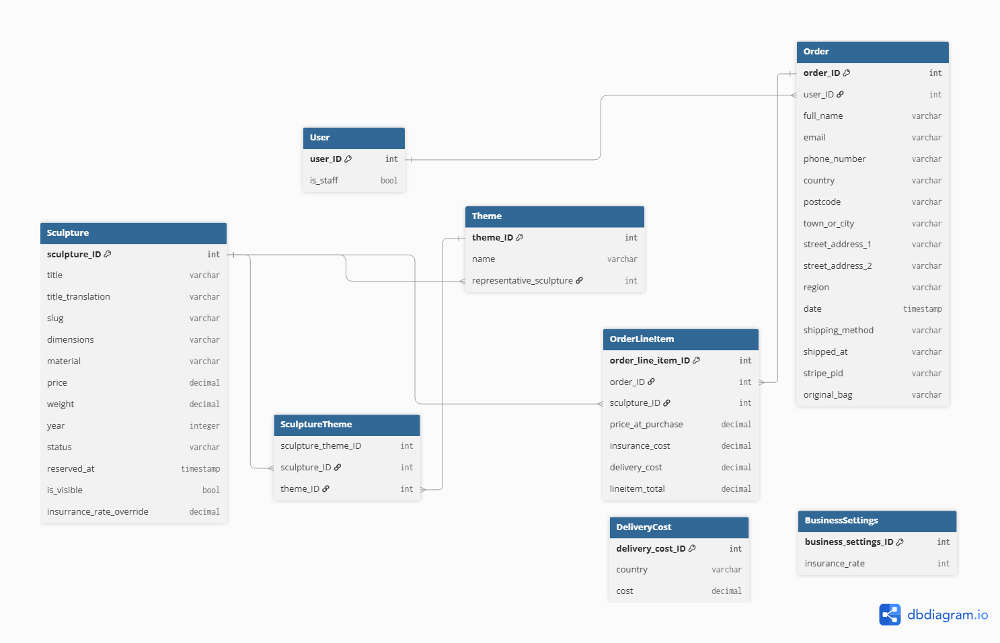
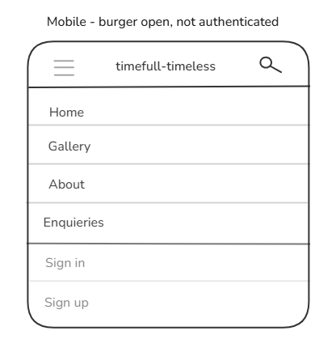
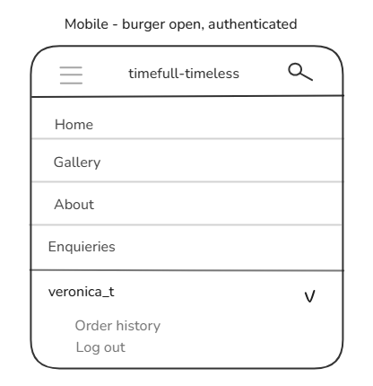
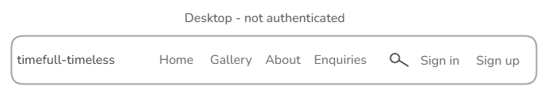
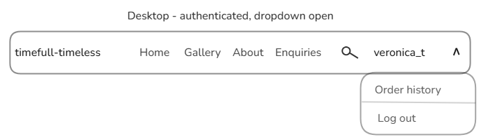
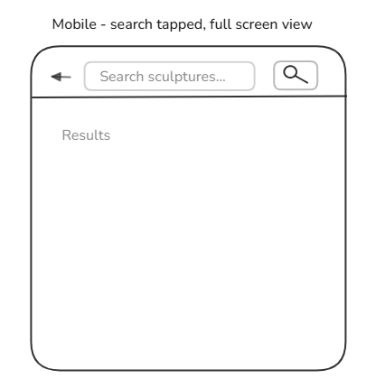
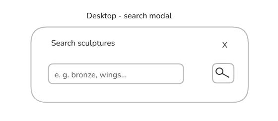
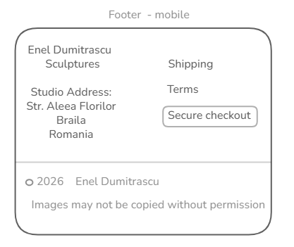
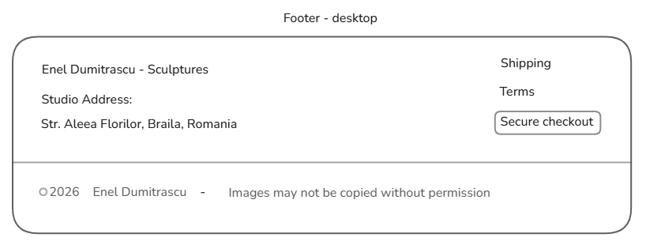

# timefull-timeless
#### *—  and a race against time*
###### *Concept & Branding by Veronica Teodorof*

Live link: https://timefull-timeless-5dc3c432f210.herokuapp.com/

A bespoke, full stack Django web application designed as a digital home for a professional sculptor. This platform strives to unify an elegant fine-art portfolio with a secure e-commerce marketplace, professional resume, and interactive business card.

The project title is a deliberate paradox rooted in the sculptor's core themes of time, flight, and angels: **"timefull"** (intentionally spelled with a double 'l' firstly for visual symmetry, and secondly, to distinguish its meaning from *timeful*) - reads literally: 'full of time', while **"timeless"** represents their eternal artistic and spiritual value.


Developed under the unforgiving watch of the Academic Deadline - the cold, merciless deity that frightens the organized students and the chaotic ones alike - this project is a race to finish before the gates lock forever. Will this chronic detail-obsessed, deadline-missing developer manage to complete the challenge? Stay tuned to find out!

---

## Table of Contents
1. [Strategy Plane](#1-strategy-plane)
   - [Business goals](#business-goals)
   - [Target Audience Segmentation: User Needs and Conversion Value](#target-audience-segmentation-user-needs-and-conversion-value)
   - [Developer Goals](#developer-goals)
   - [Resources Consulted](#resources-consulted)
2. [Scope Plane](#2-scope-plane)
   - [User Stories](#user-stories)
   - [MVP Features Index](#mvp-features-index)
   - [Data Schema](#data-schema)
3. [Skeleton Plane](#3-skeleton-plane)
4. [Surface Plane](#4-surface-plane)
5. [Deployment and local development](#5-deployment-and-local-development)
6. [Testing](#6-testing)
7. [Languages, frameworks, packages, programs](#7-languages-frameworks-packages-programs)
8. [Credits](#Credts)
9. [Acknowledgements](#acknowledgements)

---


## 1. Strategy Plane

### Business Goals (Problem - Solution)

#### 1. Secondary income from a larger audience.

**Problem**: The artist’s current income consists of a stable but low teacher's salary and occasional local gallery sales. Because his sales are currently limited to physical local galleries, his audience is restricted geographically, which limits his potential to grow his secondary income.

**Solution**: A dedicated individual portfolio website with integrated e-commerce features. This could make his artwork visible to a larger national and international audience and by integrating an e-commerce checkout, he can sell his unique contemporary sculptures directly online to this expanded market, creating a more reliable secondary income alongside his teaching salary.


#### 2. Professional separation.

**Problem**: The artist’s current digital footprint is limited entirely to a personal Facebook account that blends his personal life with his professional art. A social media account is a casual communication tool and cannot showcase a recognized sculptor’s portfolio in a professional manner. This conflicts with his first stated goal of increasing audiece for his artwork.

**Solution**: A custom portfolio website that establishes a strict professional separation from his personal Facebook profile.

#### 3. Establishing a brand.

**Problem**: While the sculptor’s artwork is deeply unique and centered around specific, powerful themes like flight, time, and angels, his current online presence does not represent this artistic vision. By relying entirely on Facebook, his identity is forced into a standard, generic layout that gets lost among millions of identical casual profiles, making it impossible to create a memorable or impactful digital brand.

**Solution**: A dedicated, custom website that establishes an original and memorable digital brand. This platform gives the artist total control over the visual presentation, allowing the website's name, logo, design, typography, and layout to directly mirror the specific themes of his sculpture, ensuring his online identity is unique and representative of his artwork.

#### 4. Establishing trust.

**Problem**: The artist has never sold his artwork online before, meaning he has no pre-existing digital reputation or track record of processing distant transactions. For a buyer looking at high-value, unique contemporary sculptures, the lack of an established, secure verification path creates high transactional hesitation and a fear of fraud.

**Solution**: A dedicated website that builds immediate consumer trust through explicit safety features and social proof. The platform will feature a direct inquiry form, giving buyers an immediate line of communication. Additionally, the site will feature a dedicated testimonials section showcasing reviews of his artwork generally, alongside specific delivery-completed reviews from verified customers regarding their online shopping experience.
Another feature that increases customer confidence is mandatory account registration before any purchase, ensuring that every high-value transaction has a reliable communication channel.


### Target Audience Segmentation: User Needs and Conversion Value

The website's user base is divided into three distinct groups based on why they visit the site, what they look for, and how they buy.

#### 1. The B2C Private Collector (Consumer Buyers)
*   **The Intent:** They use their own savings to buy original art for their homes.
*   **User Needs (International):**
    *   To feel confident about the artist's professional background and history before spending money online.
    *   To see the exact size, shape, and physical texture of a sculpture from a screen since they cannot visit the studio in person.
    *   To use a familiar, safe payment method and understand exactly how the heavy, fragile artwork will be protected during shipping and customs checks.
    *   To trust that my personal and payment information is handled securely when creating an account and making a purchase.
*   **User Needs (Local):**
    *   To browse the artist's current studio inventory online but avoid expensive delivery fees and border paperwork completely.
*   **Conversion Value [Revenue & Core Sales]:** These are the buyers who make direct purchases, creating the extra income the artist needs to support his teaching salary.

#### 2. The B2B Trade Professional (Designers, Architects & Curators)
*   **The Intent:** They are business-focused buyers who look for art using budgets from companies, institutions, or interior clients for housing projects or public exhibitions.
*   **User Needs:**
    *   To quickly find exact physical details (size, weight, materials) to make sure a heavy sculpture will fit perfectly into their client's specific room layout.
    *   To review a professional list of the artist's past exhibitions and career history so they can justify the high cost of the art to their business managers or clients.
    *   To trust that account and transaction details are kept secure and confidential, particularly for business-related purchases.
*   **Conversion Value [High-Volume & Commission Pipeline]:** These buyers represent businesses that purchase high-value items or build long-term relationships for future custom-made art commissions.

#### 3. The General Audience (Academic Peers, Art Students & Fellow Sculptors)
*   **The Intent:** They visit the site for school research, technical ideas, and to follow the local art scene or the artist's career timeline.
*   **User Needs:**
    *   To check a clean timeline of past gallery shows and public projects for school or research purposes.
    *   To have a simple way to leave feedback or read comments from other artists and exhibition visitors.
*   **Conversion Value [Reputation, SEO & Community Validation]:** These visitors do not buy art directly, but their online clicks build search engine traction. Their comments and reviews create the public trust and social proof that the actual buyers need to see before spending their money.


### Developer Goals

*   **Academic Goals [Course Completion & Passing Criteria]:** To build a complete web application that meets all the grading rules for Unit 4 (Full Stack Frameworks with Django) with a tight deadline.
*   **Professional Goals [Portfolio Piece & Future Freelance Business]:** To create an MVP website for a real-world client that serves as a main project in my personal portfolio. Building this site proves I can deliver safe, working software, which will hopefully help me start my own freelance business creating websites for people and businesses in the future. One skill to showcase is building custom, permission-gated content management (allowing the client to add/edit/delete his own sculptures, events, and bio directly within the site) rather than relying on Django's built-in admin — demonstrating the ability to deliver tailored, non-technical-user-friendly tools.


**Note on acknowledged but partially unaddressed need:** The Local Private Collector need identified above (avoiding delivery fees and border paperwork) is only partially met within this build. The Art Basel and UBS report cited below notes local markets outperformed international ones in 2025 due to customs costs, therefore a dedicated, localized Romanian offering - separate pricing, region-relevant payment methods, and a market-specific experience - would likely serve this need more effectively than a single unified international flow; business logic alone suggests building this Romanian-first. However, this project is assessed in English, and the academic constraint of the assessment governs the scope of this build. Local buyers are not excluded — studio pickup avoids shipping costs and customs complexity within the current build — but full market-specific localization is treated as a high-priority direction for the live version of the site, to be addressed once assessment constraints no longer apply.


### Resources Consulted

General market context was informed by the following industry reports

* **[The Art Basel and UBS Global Art Market Report](https://theartmarket.artbasel.com/):** https://theartmarket.artbasel.com/download/The-Art-Basel-and-UBS-Art-Market-Report-2026-by-Arts-Economics.pdf
*   **[The Deloitte Romania Art Report (with Artmark & RAD)](https://business-review.eu/lifestyle/art/romanias-art-market-shifts-toward-investment-and-growth-295739):** https://business-review.eu/lifestyle/art/deloitte-study-romanian-collectors-are-mainly-motivated-by-aesthetic-and-personal-reasons-283658

---

## 2. Scope Plane

### Theme Justification

The following themes for User Stories have been derived from the user needs, business goals, and developer goals identified at Strategy level:
- Authentication
- Sculpture/Gallery
- Cart & Checkout
- Shipping & Handling
- Artist Background (incl. Events)
- Testimonials
- Sculptor Controls
- Contact
- UX/UI

Below is a table showing how each of these themes was derived from Strategy inputs.  Not every theme is justified by all categories of stakeholders - some are driven by only one or two, therefore some cells are left blank rather than forced.

Order reflects the actual translation pipeline: Strategy (user needs + business goals + developer goals) -> Scope (with themes as the output).

| User Need | Business Goal | Developer Goal | -> Theme |
|---|---|---|---|
| Access personal account; trust that personal/payment data is handled securely | Reliable order communication for high-value transactions (no guest checkout) | — | **Authentication** |
| Browse and find pieces; see exact size/weight/material (B2C + B2B); view artwork for research/interest (academic peers, fellow sculptors) | Reach a wider audience, generate sales | — | **Sculpture/Gallery** |
| Purchase securely, track orders | Convert visitors into paying customers | — | **Cart & Checkout** |
| Trust that fragile, high-value items arrive safely | Reduce disputes/damage claims on high-value items | — | **Shipping & Handling** |
| Learn about the artist; review exhibition history (B2B + academic peers) | Establish a distinct brand, separate from personal/casual social presence | — | **Artist Background (incl. Events)** |
| See social proof before a high-value purchase | Establish trust with no prior online sales track record | — | **Testimonials** |
| — | Reduce sculptor's reliance on developer for ongoing updates; professional separation from personal admin | Demonstrates ability to build custom, permission-gated client tools (vs. relying on Django admin) — directly transferable to future freelance client work | **Sculptor Controls** |
| Ask questions before a significant purchase | Immediate line of communication builds buyer confidence | — | **Contact** |
| Usable regardless of device or ability | Avoid losing customers to poor experience, wider reach | — | **UX/UI (cross-cutting)** |


### User Stories

User stories were assessed using MoSCoW prioritisation:
M = must-have,
S = should-have,
C = could-have.

#### Authentication Theme
<details><summary>
1. As a visitor, I want to register for an account, so that I can access features reserved for registered users. (M)
</summary>


**Acceptance Criteria:**

- [ ]
- [ ]
- [ ]

</details>

<details><summary>
2. As a registered user, I want to log in to my account, so that I can access my personal information and account features. (M)
</summary>

**Acceptance Criteria:**
- [ ]
- [ ]
- [ ]

</details>

<details><summary>
3. As a logged-in user, I want to log out of my account, so that my personal information is protected. (M)
</summary>

**Acceptance Criteria:**
- [ ]
- [ ]
- [ ]

</details>

<details><summary>
4. As a new user, I want to receive a confirmation email after registering, so that I can verify my account. (M)
</summary>

**Acceptance Criteria:**
- [ ]
- [ ]
- [ ]

</details>

<details><summary>
5. As a new user, I want to click a verification link in my email to activate my account, so that I can log in and access member features. (M)
</summary>

**Acceptance Criteria:**
- [ ]
- [ ]
- [ ]

</details>

<details><summary>
6. As a visitor without an account, I want to be prompted to register or log in when I try to purchase, so that my order is tied to a verified account. (M)
</summary>

**Acceptance Criteria:**
- [ ]
- [ ]
- [ ]

</details>


#### Sculpture/Gallery (browse, filter) Theme

<details><summary>
7. As a visitor, I want to be able to see a selection of artist's sculptures ordered by theme, so that I get to understand the artistic vision of this sculptor. (M)
</summary>

**Acceptance Criteria:**
- [ ]
- [ ]
- [ ]

</details>

<details><summary>
8. As a visitor, I want to be able to see a representative image of the sculpture, along with a full description of material, dimensions, and price, so that I'm fully informed about that particular artwork. (M)
</summary>

**Acceptance Criteria:**
- [ ]
- [ ]
- [ ]

</details>

<details><summary>
9. As a visitor, I want to filter sculptures by material and availability, so that I can find pieces that match what I'm looking for and are still available for purchase. (S)
</summary>

**Acceptance Criteria:**
- [ ]
- [ ]
- [ ]

</details>

<details><summary>
10. As a visitor, I want to search for sculptures by keyword from anywhere on the site, so that I can quickly find a specific piece or theme without browsing the full gallery. (S)
</summary>

**Acceptance Criteria:**
- [ ] Given I am on any page, when I click the search icon, then a search modal opens (fullscreen on mobile, centred on desktop).
- [ ] Given I enter a search term and submit, when the search runs, then I am shown sculptures whose title, description, or theme name match my search term.
- [ ] Given my search term matches no sculptures, when the results page loads, then I see a message indicating no sculptures were found, along with a link back to the full gallery.
- [ ] Given I submit an empty search, when the results page loads, I am directed to the gallery page.
- [ ] Given I press Enter or click/tap submit button after typing my search term, when the form submits, I am taken to results page or to gallery page as appropriate.

</details>

#### Cart & Checkout (including order history) Theme

<details><summary>
11. As a registered user, I want to add a sculpture to my cart, so that I can proceed to payment. (M)
</summary>

**Acceptance Criteria:**
- [ ]
- [ ]
- [ ]

</details>

<details><summary>
12. As a registered user, I want to provide my delivery details and complete payment securely, so that I can finalize the transaction. (M)
</summary>

**Acceptance Criteria:**
- [ ]
- [ ]
- [ ]

</details>

<details><summary>
13. As a registered user, I want to be clearly informed whether delivery is available to my country, so that I know whether I can proceed to payment. (M)
</summary>

**Acceptance Criteria:**
- [ ]
- [ ]
- [ ]

</details>

<details><summary>
14. As a registered user, I want to choose between home delivery and studio pickup before payment, so that I can select the option that best suits me. (M)
</summary>

**Acceptance Criteria:**
- [ ]
- [ ]
- [ ]

</details>

<details><summary>
15. As a registered user, I want to provide my delivery details and be redirected to a secure payment page to complete my purchase, so that I can finalize the transaction. (M)
</summary>

**Acceptance Criteria:**
- [ ]
- [ ]
- [ ]

</details>

<details><summary>
16. As a registered user, I want to receive feedback on whether my transaction was successful or not, so that I am aware of the outcome. (M)
</summary>

**Acceptance Criteria:**
- [ ]
- [ ]
- [ ]

</details>

<details><summary>
17. As a registered user, I want to see the total price and a breakdown of costs before making a payment, so that I know exactly what I'm being charged for. (M)
</summary>

**Acceptance Criteria:**
- [ ]
- [ ]
- [ ]

</details>

<details><summary>
18. As a registered user, I want to view my order history, so that I can review my past purchases. (S)
</summary>

**Acceptance Criteria:**
- [ ]
- [ ]
- [ ]

</details>


#### Shipping & Handling Theme

<details><summary>
19. As a visitor, I want to know how my order would be packed and shipped, so that I feel confident the artwork will arrive safely. (M)
</summary>

**Acceptance Criteria:**
- [ ]
- [ ]
- [ ]

</details>

<details><summary>
20. As a registered user, I want to be offered transparent information about insurance and insurance costs, so that I can make an informed decision when buying a sculpture. (M)
</summary>

**Acceptance Criteria:**
- [ ]
- [ ]
- [ ]

</details>

<details><summary>
21. As a registered user, I want to be informed that a Certificate of Authenticity is included with my purchase, so that I can trust the piece's provenance and value. (S)
</summary>

**Acceptance Criteria:**
- [ ]
- [ ]
- [ ]

</details>


#### Artist Background Theme

<details><summary>
22. As a visitor, I want to learn about the sculptor's background, so that I can understand his artistic journey and history. (M)
</summary>

**Acceptance Criteria:**
- [ ]
- [ ]
- [ ]

</details>

<details><summary>
23. As a visitor, I want to be informed of the sculptor's past and upcoming events, so that I can understand his presence in the local artistic world and visit one of his exhibitions if I have the chance. (S)
</summary>

**Acceptance Criteria:**
- [ ]
- [ ]
- [ ]

</details>

#### Testimonials Theme

<details><summary>
24. As an authenticated user, I want to share my impressions of the sculptor's work, so that I can express my appreciation and contribute to the site's community of supporters. (S)
</summary>

**Acceptance Criteria:**
- [ ]
- [ ]
- [ ]

</details>

<details><summary>
25. As a verified buyer, I want to share a testimonial about my purchase experience, so that other prospective buyers can trust the quality, value, and overall service. (S)
</summary>

**Acceptance Criteria:**
- [ ]
- [ ]
- [ ]

</details>

<details><summary>
26. As a registered user, I want to edit or delete my own testimonial, so that I can keep it accurate or remove it if my views change. (S)
</summary>

**Acceptance Criteria:**
- [ ]
- [ ]
- [ ]

</details>

<details><summary>
27. As a visitor, I want to filter testimonials by type (general impressions or verified purchase experiences), so that I can find the perspective most relevant to me. (C)
</summary>

**Acceptance Criteria:**
- [ ]
- [ ]
- [ ]

</details>


#### Sculptor Controls Theme

<details><summary>
28. As the sculptor, I want my account to have elevated permissions, so that only I can access content-management controls across the site. (M)
</summary>

**Acceptance Criteria:**
- [ ]
- [ ]
- [ ]

</details>

<details><summary>
29. As the sculptor, I want to add, edit, or delete themes (with safeguards preventing deletion of a theme still assigned to sculptures), so that I can keep my thematic index accurate and up to date. (M)
</summary>

**Acceptance Criteria:**
- [ ]
- [ ]
- [ ]

</details>

<details><summary>
30. As the sculptor, I want to upload or replace a sculpture's image when adding or editing it, so that the listing accurately reflects the artwork. (M)
</summary>

**Acceptance Criteria:**
- [ ]
- [ ]
- [ ]

</details>

<details><summary>
31. As the sculptor, I want to add a new sculpture, edit the details of an existing one, or remove it from the gallery (permanently deleting it if never sold, or archiving it if it has been), so that I have complete control over what's displayed in my gallery page. (M)
</summary>

**Acceptance Criteria:**
- [ ]
- [ ]
- [ ]

</details>

<details><summary>
32. As the sculptor, I want to be notified by email and see a list of new orders, so that I know what to prepare and ship. (M)
</summary>

**Acceptance Criteria:**
- [ ]
- [ ]
- [ ]

</details>

<details><summary>
33. As the sculptor, I want to edit the content of my bio, so that I keep it up to date. (C)
</summary>

**Acceptance Criteria:**
- [ ]
- [ ]
- [ ]

</details>

<details><summary>
34. As the sculptor, I want to add, edit, or remove events, so that I keep a clear and accurate list of my participations. (C)
</summary>

**Acceptance Criteria:**
- [ ]
- [ ]
- [ ]

</details>
<details><summary>
35. As the sculptor, I want to edit the content of my bio, so that I keep it up to date. (C)
</summary>

**Acceptance Criteria:**
- [ ]
- [ ]
- [ ]

</details>

<details><summary>
36. As the sculptor, I want my sculpture images to display a watermark with my name and the site identifier, so that my work is protected from unauthorized reuse if the images are copied or shared outside the site. (M)
</summary>

**Acceptance Criteria:**
- [ ]
- [ ]
- [ ]

</details>


#### Contact Theme

<details><summary>
37. As a site visitor, I want to be able to send the sculptor a message for any reason - inquiries about a piece, custom commissions, collaborations, or general questions — so that I can reach him directly regardless of my purpose for visiting. (M)
</summary>

**Acceptance Criteria:**
- [ ]
- [ ]
- [ ]

</details>


#### UX/UI Theme

<details><summary>
38. As a visitor, I want to be welcomed by a homepage that represents the artist's work and vision, so that I'm invited to explore further. (M)
</summary>

**Acceptance Criteria:**
- [ ]
- [ ]
- [ ]

</details>

<details><summary>
39. As a visitor, I want the site to adapt to my screen size (mobile, tablet, desktop), so that I can browse and shop comfortably on any device. (M)
</summary>

**Acceptance Criteria:**
- [ ] Given I am on a mobile-width screen (<992px), when I load any page, then the navigation bar shows a burger icon, centred logo, and search icon, with navigation links and authentication state contained within a collapsible drawer.
- [ ] Given I am on a desktop-width screen (≥992px), when I load any page, then the navigation bar shows the logo, navigation links, search icon, and authentication state inline in a single row, with no burger icon.
- [ ] Given I open the search modal, when I am on a mobile-width screen, then the modal displays fullscreen; when I am on a desktop-width screen, then the modal displays centred.

</details>

<details><summary>
40. As a visitor with accessibility needs, I want the site to follow accessibility best practices (screen reader support, keyboard navigation, sufficient colour contrast), so that I can use the site regardless of ability. (M)
</summary>

**Acceptance Criteria:**
- [ ]
- [ ]
- [ ]

</details>

<details><summary>
41. As a visitor, I want easy and intuitive navigation throughout the site, so that I can find what I'm looking for without confusion. (M)
</summary>

**Acceptance Criteria:**
- [ ] Given I am on any page, when I look at the navigation bar, then I can see links to Home, Gallery, About, and Enquiries.
- [ ] Given I click the logo, when the page loads, then I am taken to the home page.
- [ ] Given I click any navigation link, when the corresponding page loads, then the link correctly navigates me there with no broken links.
- [ ] Given I am not authenticated, when I look at the navigation bar, then I see Sign in and Sign up options.
- [ ] Given I am authenticated, when I look at the navigation bar, then I see my username in place of Sign in/Sign up.
- [ ] Given I am authenticated and click my username, when the dropdown opens, then I see Order History and Log out options.
- [ ] Given I click Log out, when the action completes, then I am logged out and redirected to home page.

</details>

<details><summary>
42. As a user, I want clear feedback on all my relevant interactions with the website (adding to cart, submitting forms, completing payment, etc.), so that I always know the outcome of my actions. (M)
</summary>

**Acceptance Criteria:**
- [ ]
- [ ]
- [ ]

</details>


Must-have user stories will form the MVP and will be treated as highest priority, with should-have stories following as the first MVP stretch and could-have stories picked up after, time permitting. Won't-have (the Romanian version of the website) is mentioned in the Strategy plane.

The MVP leaves out the CUD (Create, Update, Delete) operations for the testimonials theme, which is instead addressed as a handful of hardcoded entries; full CRUD for testimonials is the next priority after MVP. Similarly, CUD operations for the artist's biography and events are left out, with only a hardcoded page present - these were scoped as could-have stories. Both the testimonials and artist's biography pages will initially render as static pages, and once the MVP is complete, they will be extracted into dedicated apps with their own custom models, views, and URLs


### MVP Features Index:
- Authentication: register an account, sign in/out, account verification
- Gallery/Sculptor Controls: full CRUD for Themes and Sculptures
- Full cart and checkout process, with user feedback
- Delivery, packaging, and insurance information
- Artist's biography (static page)
- Contact form
- Home page

**Non-functional requirements**: accessibility, responsiveness, and interaction feedback across all pages, watermarked images


### Data Schema

This schema was designed loosely following the steps recommended by Hernandez's methodology (identifying models, fields, field specifications, relationships, and business constraints), as outlined in Hernandez (2021), but adapted to the scale of this project's database.

#### Models
Most models were derived directly from the user stories, with some being self-evident (**User**, **Sculpture**, **Order**), while others were adapted from Code Institute's "Boutique Ado" tutorial (**OrderLineItem**) - patterns that may be well-known to an experienced e-commerce developer, but were not obvious on a first build.

In selecting the remaining models, my guiding principle was to favour models over hardcoded constants where the underlying data varies across a dimension the business owner might need to manage independently. **Theme** emerged as a model on this basis: the artist may want to explore new themes, add themes from his existing repertoire that had no saleable pieces at the time of development, or remove themes he no longer produces work for. **Biography**, **Events**, and **Testimonial** were identified as candidates under this same principle, but their CUD operations were excluded from the tight MVP, and their models deferred accordingly.

The biggest unknowns, in terms of their practical meaning for this business, were **Insurance**, **Customs**, and **Delivery**. As each country/economic area has its own policies, my decision was to limit the scope of this project to two countries: Romania, the local market, and the UK, for the international one. Why the UK? The language of the project is English, for one; secondly, choosing the EU area instead would mean dealing with more variables per country; and third, but perhaps most important, the UK represents the second largest market in the world for fine-art buying, according to the Art Market Report cited in the Strategy section. Decisions detailed below were made by the developer after independent research, and represent placeholders for the business's actual policies - to be confirmed with the client once the site is live and such policies are formally established.

**Insurance** rates were found to generally range from 0.8% to 2% of item value; 1.5% was chosen as a reasonable midpoint for a flat MVP rate. Rather than becoming a model of its own, insurance is expressed as fields across three existing models: the global rate lives on `BusinessSettings` (a Django singleton model, editable by the business owner via the admin interface, without developer involvement), a nullable `insurance_rate_override` field was added to Sculpture - a low-cost addition now that allows individually appraised, per-sculpture insurance pricing to be introduced later without a schema change - and the calculated `insurance_cost` for a specific purchase is stored on
OrderLineItem at checkout time. Insurance was deliberately not modelled as its own entity, since it represents a single, globally-applied calculation rather than data varying across independent rows, unlike **DeliveryCost**.

**Customs duty** was found not to apply, since each sculpture is unique — an "original" work, not a reproduction or cast edition — which qualifies for the UK's duty exemption on original art. **Import VAT** still applies, but at a reduced rate of 5% (rather than the standard 20%) for the same reason. VAT is payable by the customer (the importer), collected by the courier either before or after delivery depending on their policy, and is not calculated or collected at checkout. This is disclosed to the customer in the Terms and Conditions, and again before the checkout process is completed, to ensure the buyer is aware of this additional cost before finalizing their purchase.

As this applies uniformly to all sculptures, it required no schema changes — only static template content, phrased informationally rather than as a guarantee, since final customs treatment depends on the importing authority's own assessment.

**Delivery** costs were found to vary meaningfully based on package weight, dimensions, and destination. Given that the artist's sculptures are consistently small and lightweight (under approximately 3kg), the lower end of the researched range is representative, and a flat rate per country was chosen for MVP rather than a weight/dimension-based calculation.

Two ways for a buyer to receive their purchase were identified: studio pickup (no additional cost) and delivery (a fixed cost per country). `shipping_method` is implemented as a field on Order, distinguishing between the two, since this is a single choice covering the whole order. Delivery cost itself, however, is calculated per sculpture and stored on a `delivery_cost` field on OrderLineItem, reflecting that each sculpture ships in its own separate crate with its own individual cost - a multi-sculpture order therefore incurs delivery cost per item, not once per order. A dedicated **DeliveryCost** model holds one row per supported country (Romania, UK), each with an owner-editable flat rate, consistent with the same reasoning applied to Theme earlier - this data varies by country and the business owner may need to adjust it independently. Order aggregates each line item's price, insurance, and delivery cost into its `grand_total`.

**Final Models List:**

- **User** (Authentication Theme Stories 1-6, Sculptor Controls Story 27) - stores data about those using the website and allows registering for an account, signing in and out of it, verifying an account; the sculptor's elevated permissions are managed via Django's built-in is_staff flag rather than a separate model
- **Theme** (Gallery/Sculpture Story 7 and Sculptor Controls Story 28) - stores data about the general concepts embodied by the sculptures and allows the sculptor the flexibility of handling creation, editing and deletion without developer's aid; necessary since themes presented on website are likely to vary depending on availability of sculptures from certain themes, or the sculptor exploring and presenting new themes
- **Sculpture** (Gallery/Sculpture Stories 7-9 and Sculptor Controls Stories 29-30) - stores data about the artwork presented on the site, is the central focus of the entire web application; necessary for giving the artist full control over which artworks are being presented and editing information about them
- **Order** (Cart & Checkout Stories 11-17) - stores data about a specific purchase; necessary to enable the e-commerce feature of this website
- **OrderLineItem** (Cart & Checkout Stories 10, 16, 17) - stores data about each specific item in a purchase, linking an Order to the Sculpture(s) it contains; necessary since one order can hold several sculptures, and each needs to be represented individually
- **DeliveryCost** (Cart & Checkout Stories 12, 13 and Shipping & Handling Theme Story 18) - stores a flat delivery cost per supported country; necessary for calculating total order costs when delivery, rather than studio pickup, is selected
- **BusinessSettings** (no direct story citation) - a singleton model holding rarely-changed, owner-editable business constants (e.g. the insurance rate); necessary to give the business owner control over these values without developer involvement, consistent with the guiding principle established earlier in this section

#### Fields & Field Specifications

Field identification and field specifications are presented together per model below, rather than as separate passes, for readability — each field is listed alongside its type and constraints directly.  Additionally,  field specifications here are described directly using Django model field types and options (e.g. `CharField`), rather than abstract data types to keep documentation and implementation tightly aligned and avoid duplicating effort across a separate abstract schema and its Django translation.

**Note:** Relation fields are listed here for completeness, with full justification for non-trivial relationships provided in the Relationships section below


**User**

| Field | Type | Notes |
|---|---|---|
| username | CharField | Django default |
| email | EmailField | Django default |
| password | CharField (hashed) | Django default |
| is_staff | BooleanField(default=False) | Used to distinguish the sculptor's elevated permissions from regular registered users (see Models section for reasoning) |

**Theme**

| Field | Type | Notes |
|---|---|---|
| name | CharField(max_length=100) | |
| representative_sculpture | ForeignKey(Sculpture, null=True, blank=True, on_delete=SET_NULL, related_name='representing_themes') | See Relationships and Constraints section. Falls back to most recently added sculpture's image if unset |

**Sculpture**

| Field | Type | Notes |
|---|---|---|
| title | CharField(max_length=200) | The sculpture's original title, in Romanian |
| title_translation | CharField(max_length=200, null=True, blank=True) | English translation of the title, for non-Romanian-speaking visitors; not a second title * |
| slug | SlugField(max_length=220, unique=True, blank=True) | Auto-generated from `title` on save |
| dimensions | CharField(max_length=100) | Free-text (e.g. "32 x 18 x 15 cm"); chosen over structured height/width/depth fields since source data isn't consistently available in that format |
| material | CharField(max_length=100) | Free-text; materials vary (metal, wood, glass, etc.) and aren't a fixed set, so `choices` was avoided in favour of flexibility |
| price | DecimalField(max_digits=6, decimal_places=2) | |
| weight | DecimalField(max_digits=4, decimal_places=2, null=True, blank=True) | Expressed in kg. Not currently recorded by the artist; added in anticipation of future shipping/insurance calculations that may require it. Nullable for now, since no existing weight data is available |
| year | PositiveIntegerField, validators=[MinValueValidator, MaxValueValidator(current year)] | Year of creation, consistently present in the artist's own records; bounded to prevent implausible values (e.g. future dates or years before the artist's career began) |
| image | CloudinaryField('image') | Required; images hosted via Cloudinary, since typical hosting platforms don't persist file uploads reliably |
| status | CharField(max_length=10, choices=[('available','Available'),('reserved','Reserved'),('sold','Sold')], default='available') | See Relationships and Constraints p. 3 |
| reserved_at | DateTimeField(null=True, blank=True) | Timestamp set when status changes to 'reserved'. See Relationships and Constraints p.4 |
| is_visible | BooleanField(default=True) | See Business Constraints |
| insurance_rate_override | DecimalFiel(max_digits=5, decimal_places=4, null=True, blank=True) | Optional per-sculpture override; global rate used if null (see Models section) |
| themes | ManyToManyField(Theme, related_name='sculptures') | See Relationships and Constraints p.2 |

* title_translation was added despite not being tied to a specific user story, to preserve the authenticity of the artist's original naming (in Romanian) while still making titles accessible to an English-speaking audience - a translation displayed alongside the original, not a replacement for it.


**OrderLineItem**

| Field | Type | Notes |
|---|---|---|
| order | ForeignKey(Order) | |
| sculpture | ForeignKey(Sculpture) | |
| price_at_purchase | DecimalField(max_digits=6, decimal_places=2) | Snapshot of Sculpture.price at time of purchase |
| insurance_cost | DecimalField(max_digits=5, decimal_places=2) | Calculated from price_at_purchase × insurance rate (global or per-sculpture override) at checkout |
| delivery_cost | DecimalField(max_digits=5, decimal_places=2) | Looked up from DeliveryCost based on the order's delivery country at checkout; 0 if pickup |
| lineitem_total | DecimalField(max_digits=7, decimal_places=2) | price_at_purchase + insurance_cost + delivery_cost; aggregated into Order.grand_total |

**Order**

Fields largely follow the structure of Code Institute's "Boutique Ado" tutorial's Order model, adapted where this project's requirements differ (see Notes column for deviations).

| Field | Type | Notes |
|---|---|---|
| order_number | CharField(max_length=32, editable=False) | Generated via UUID at save time, not user-entered (adapted from Boutique Ado) |
| user | ForeignKey(User) | |
| full_name | CharField(max_length=50) | |
| email | EmailField(max_length=254) | |
| phone_number | CharField(max_length=20) | |
| country | CharField(max_length=2) | see Relationships and Constraints p.5 |
| postcode | CharField(max_length=20, null=True, blank=True) | See Relationships and Constraints p.6 |
| town_or_city | CharField(max_length=40) | |
| street_address1 | CharField(max_length=80) | |
| street_address2 | CharField(max_length=80, null=True, blank=True) | |
| region | CharField(max_length=80, null=True, blank=True) | |
| date | DateTimeField(auto_now_add=True) | |
| shipping_method | CharField(choices=[('delivery','Delivery'),('pickup','Studio Pickup')]) | |
| shipped_at | DateTimeField(null=True, blank=True) | Set when the order is marked shipped, supporting the same/next-weekday commitment |
| stripe_pid | CharField(max_length=254) | |
| original_bag | TextField(default='') | Retained from Boutique Ado tutorial as a defensive snapshot of cart contents at checkout, pending full understanding of Stripe's webhook flow. |

`order_total`, `insurance_total`, `delivery_total`, and `grand_total` are not stored as fields - they are computed dynamically via properties, since they are always derivable from already-snapshotted OrderLineItem values (see Fields- OrderLineItem).


**DeliveryCost**

| Field | Type | Notes |
|---|---|---|
| country | CharField(max_length=2, choices=[('RO', 'Romania'), ('UK', 'United Kingdom')]) | |
| cost | DecimalField(max_digits=5, decimal_places=2) | Flat rate per country; owner-editable |

**Business Settings**

| Field | Type | Notes |
|---|---|---|
| insurance_rate | DecimalField(max_digits=5, decimal_places=4, default=0.015) | Global insurance rate; owner-editable via Django admin |


#### Relationships and Constraints
1. The FK from Theme.representative_sculpture to Sculpture doesn't prevent the same sculpture from being set as representative for more than one theme. In practice, the chosen sculpture should belong to the theme it represents, but this isn't enforced at the model field level (would need to be checked in clean() if enforcement is added later).
2. M2M relationship — one sculpture can have many themes, one theme can belong to many sculptures. Since sculptures are presented in gallery by theme, this field should be required on Sculpture, but M2M fields can't enforce "required" at the model level, so this is enforced in forms instead.
3. This constraint is related to the uniqueness of the artworks on this website. Three status labels have been chosen to represent availability of the sculpture, with 'available' being default. 'Reserved' can be set either automatically when a user adds the artwork to their selection, this status will be removed if a certain fixed amount of tiem ( probably 15 min) has passed and the sculpture hasn't been aquired; but it can also be set or removed manually, when the artist personally wants to reserve it for a potential buyer, still in negotiation/ talking fase. This is to prevent a sculpture being sold twice, either via online sales alone, or online and in person. The third status, 'sold' is again set in two ways: automatically after a successful payment or manually after an in person sale. 'Sold' status can never be undone to prevent accidental rebuying, when a sculpture is returned after a purchase, the only way it can become available again is to be readded with initial sale being set to is_visible = False, to prevent duplicate view whilst keeping order history intact, or deleting and re-entering it, if the sale was in-person (no order record to preserve, so no need to keep the row around).
4. 'reserved_at' on Sculpture records when a sculpture was added to someone's selection, so the countdown to revert 'reserved' back to 'available' can be calculated. If payment succeeds first, status moves to 'sold' instead.
5. 'country' on Order is restricted to countries where delivery is currently available. The list can expand once shipping processes are set up for new destinations.
6. Although postcode is an important part of the delivery process in the UK, in Romania it's in practice not frequently used and buyers may not specify it - this field is therefore set to 'null=True', 'blank=True'.

#### ERD

<p align="center">
  
</p>

Notes:
- `Theme.slug` was added after the ERD was finalized (not shown in diagram). It is needed to link to a dedicated filtered view (/gallery/theme/<slug>/) giving clean, shareable URLs.

- `Sculpture.is_manually_reserved` was added after the ERD was finalized (not shown in diagram). Needed to distinguish reservations made manually by the artist (never auto-expire) from automatic reservations created when a sculpture is added to a buyer's selection (revert to available after 20–30 min if not purchased).

- `Sculpture.reserved_by` was added after the ERD was finalized (not shown in diagram). Needed to distinguish who holds a reservation, so only that buyer can complete the purchase while others still see the sculpture as reserved.


#### Resources consulted
**Database design principles**
- Hernandez, M. J. (2021). *Database Design for Mere Mortals: 25th Anniversary Edition*. Addison-Wesley Professional.

**OrderLineItem and Order models**

Code Institute - *Boutique Ado* tutorial

**Fine-art shipping insurance research**
- https://fineartshippers.com/art-shipping-insurance-pricing-checklist-for-an-art-owner/
- MoMAA https://momaa.org/art-shipping-insurance-calculator/

**Original sculpture customs and VAT research**
- https://conventuslaw.com/report/navigating-cross-border-art-transactions-legal-and-tax-insights-for-collectors/
- https://www.art2arts.co.uk/sending-artwork-between-eu-and-uk
- https://www.loughercontemporary.com/blogs/editorial/understanding-import-vat-for-art-collectors-a-comprehensive-guide

**Delivery**
- https://www.tsishipping.com/resource-center/how-do-i-ship-sculpture

**Implementation:**
- Django Singleton Model - https://www.vicentereyes.org/blog/the-django-singleton-model-how-to-manage-page-headers-without-a-cms-c47a90f8-
- Django validators - https://docs.djangoproject.com/en/6.1/ref/validators/
- Cloudinary Field - https://cloudinary.com/documentation/django_image_and_video_upload#set_upload_options_on_a_cloudinaryfield

---

## 3. Skeleton Plane

### From Models to Apps

The models identified in the Scope plane were distributed across three apps:

- **gallery** — Sculpture, Theme (with a many-to-many relationship between them)
- **checkout** — Order, OrderLineItem, DeliveryCost
- **pages** — BusinessSettings

Models identified in the Scope plane were grouped into apps according to three criteria.

Firstly, reusability and portability - my tutor stressed that Django apps are most valuable as self-contained, reusable components, so models were grouped to maximise the likelihood that an app could be reused across future projects with minimal modification.
Both DeliveryCost and BusinessSettings (insurance rate) are admin-editable rates that feed into an order's final cost, and both could sit in either checkout or pages. The deciding factor was reusability: delivery cost by destination is an almost universal e-commerce need, so keeping it in checkout preserves that app as a portable, drop-in component. Insurance on fragile items, by contrast, is specific to this gallery's business model, not a generic commerce concern - so it belongs in pages alongside other site-specific configuration.


Secondly, each individual app was checked to ensure it matches a natural aspect of the project, with no app being too small or too big = a common approach being to encapsulate each tightly-connected set of models within a single app.

Finally, any data relevant to multiple apps was shared rather than duplicated, with apps depending on one another where necessary rather than each holding a separate copy of the same information.


### Layout and mechanics per feature

#### Navigation bar

**Responsiveness - Mechanics**

The navigation bar contains four blocks of elements: the logo, navigation links (common across authentication states), the search feature, and the authentication-state block. Because these blocks are arranged differently depending on screen width, the template contains two divs — one holding the small/medium screen arrangement, the other the large-screen arrangement - each including the same three partials and a partial definition (``, `_nav_links.html`, `_nav_search.html`, `_nav_auth.html`), positioned differently within each div. This avoids duplicating any block's content while still allowing each breakpoint its own arrangement.

**Responsiveness - Layout**

- Mobile: burger icon (left), logo (centre), search icon (right). Navigation links and the authentication-state block sit inside the collapsible drawer, revealed by the burger.
- Desktop: logo (left), navigation links, search icon, and the authentication-state block, all inline in a single row.
- Tablet is not wireframed separately; it inherits the mobile arrangement below the chosen breakpoint and the desktop arrangement above it, per standard Bootstrap breakpoint behaviour.

*Wireframes: mobile - burger open, not authenticated; mobile - burger open, authenticated; desktop - not authenticated; desktop - authenticated.*

<p align="center">
  
  


  
  
</p>

---

**Authentication - Mechanics**

The authentication-state block renders conditionally based on `user.is_authenticated` inside the `_nav_auth.html` partial.  When not authenticated, it shows Sign in / Sign up. When authenticated, it shows the username in place of those links, which reveals a dropdown containing Order History and Log out. This keeps the block's position within the nav consistent across both states - only its content changes.


**Authentication - Layout**

- Mobile: the authentication-state block sits inside the burger drawer, after the Enquiries link. Tapping the username expands the dropdown inline within the drawer.
- Desktop: the authentication-state block sits at the right of the nav bar. Clicking the username reveals a dropdown (Order History, Log out) - standard Bootstrap .dropdown/.dropdown-menu behaviour within a navbar

---

**Search - Mechanics**

Search matches against sculpture title, description, and theme name, combined in a single query:

```python
results = Sculpture.objects.filter(
    Q(name__icontains=query) |
    Q(description__icontains=query) |
    Q(theme__name__icontains=query)
).prefetch_related("theme").distinct()
```

`.distinct()` prevents duplicate rows where the many-to-many join to Theme produces more than one match per sculpture. This scope was chosen deliberately alongside the planned Material and Availability filters and theme-card browsing: those will provide precise, structured browsing by known categories, so search covers the cases they don't - free-text matches within a sculpture's own name or description - while also offering a quick way to find sculptures matching a particular query, from anywhere on the site.

Live "results as you type" was considered but deferred as a future improvement.

**Search - Layout**

- The search modal is a single Bootstrap component (modal-fullscreen-lg-down) shared across breakpoints: fullscreen below lg, a centred modal at lg and above - matching the nav's own mobile/desktop breakpoint.

*Wireframes: desktop search modal; mobile fullscreen search modal*

<p align="center">
  
  

</p>

---
#### Footer
**Layout** - contains studio address, links to Shippment and Terms, a Secure Checkout badge and copyright.

*Wireframes: desktop footer; mobile footer*

<p align="center">
  
  

</p>

### Security Features
- The sign-up form requires email to be typed twice to catch typos at registration, since email communication is essential to this website (order confirmations, availability updates, etc.).
- A honeypot input field was added as a first layer of protection against naive spam bots.

### Resources Consulted:
- Complex lookups with Q objects and `prefetch_related()` queryset:
  - Code Institute: 'Boutique Ado'
  - https://docs.djangoproject.com/en/6.0/topics/db/queries/#complex-lookups-with-q-objects
  - https://docs.djangoproject.com/en/6.0/ref/models/querysets/#prefetch-related
  - empty guard and chaining prefetch_related() and distinct(): https://micropyramid.com/blog/querying-with-django-q-objects/
- Bootstrap breakpoints for modals:
  - https://getbootstrap.com/docs/5.3/layout/breakpoints/
---

## 4. Surface Plane

---

## 5. Deployment and local development
### Deployment

This project was deployed on Heroku following the next steps:

#### Prerequisites
- Heroku account
- GitHub account
- Git installed locally
- gunicorn installed locally and added to requirements.txt

#### Files Required
- A `Procfile` in the root directory of the project, containing the command that Heroku will use to start the server:
`web: gunicorn timefull_timeless.wsgi`

Initially I had a hyphen instead of an underscore (`timefull-timeless` instead of `timefull_timeless`), which made gunicorn unable to import the app as a Python module — Python module names can't contain hyphens — resulting in `ModuleNotFoundError` and an application error on deploy.

- A `.python-version` file in the root directory, pinning the Python version used locally (e.g. `3.12`), so Heroku's buildpack uses a matching interpreter rather than defaulting to its current default version.

#### Config Vars
- Before deploying, the following Config Vars were set in the Heroku app's Settings tab: `SECRET_KEY`, `DATABASE_URL`.


#### Steps
1. Sign into Heroku, navigate to the dashboard, and create a new app with a unique name.
2. In the app click on the `Deploy` tab.
3. In the Deployment method section click on `Connect to GitHub` and authenticate.
4. Search for repository name and click `Connect`.
5. Scroll to the bottom of the page and click `Deploy Branch` to start a manual deployment of the main branch.
6. Click on `Open App` to view deployed project.

Access the live app: https://timefull-timeless-5dc3c432f210.herokuapp.com/

### Local development

The project was managed in GitHub: https://github.com/VeronicaTeodorof/timefull-timeless

**To fork the project:**
1. Navigate to the project's page in GitHub.
2. Click on the fork icon.
3. Select a new branch, name it and click `Create Fork`.

**To clone the project:**
1. Navigate to the project's page in GitHub.
2. Click the `Code` button and copy the URL shown.
3. Open your code editor and select a directory for the project.
4. In the terminal of that directory type 'git clone' followed by the copied URL and press enter.
5. Create and activate a virtual environment, then install project's dependencies.
6. Create an `env.py` file in the root directory containing the same variables listed in the Config Vars above using your own values.
7. Migrate: `python manage.py migrate`.
8. Run the project locally: `python manage.py runserver`.

---

## 6. Testing
### Resources consulted

**Testing Models**
- for testing field existance: https://docs.djangoproject.com/en/6.1/ref/models/meta/
- for testing field type: https://www.geeksforgeeks.org/python/python-unittest-assertisinstance-function/
- for testing Cloudinary field: https://github.com/cloudinary/pycloudinary/blob/master/django_tests/test_cloudinaryField.py


---

## 7. Languages, frameworkds, packages, programs

### Languages

- Python
- HTML
- CSS

### Packages

- Django 6.1
- psycopg 3.3.4 (PostgreSQL database adapter)
- dj-database-url (Parses DATABASE_URL into Django settings)
- django-allauth 65.19.1 for authentication
- gunicorn 26.0.0 - WSGI server used for deployment
- cloudinary-1.46.0 - cloud based image hosting and transformation

### Front-end libraries
- Bootstrap 5.3.8: https://getbootstrap.com/

### Development tools/ programs

- VS Code (IDE)
- Git & GitHub (version control)
- dbdiagram.io: https://dbdiagram.io/home (ERD)
- excalidraw: https://excalidraw.com/ (wireframes)

## 8. Credits

### Develpment resources
- for psycopg version to be installed: https://www.psycopg.org/psycopg3/docs/basic/install.html

**Allauth**
- for allauth settings:
  -  https://docs.allauth.org/en/latest/installation/quickstart.html
  -  https://docs.allauth.org/en/latest/account/configuration.html
- for sending emails - django:  https://docs.djangoproject.com/en/6.1/topics/email/
- for overriding allauth default templates: https://www.makeuseof.com/override-default-templates-django-allauth/

**Django models**
- constraints: https://docs.djangoproject.com/en/6.0/ref/models/constraints/
- database functions - Lower(): https://docs.djangoproject.com/en/6.0/ref/models/database-functions/#lower

