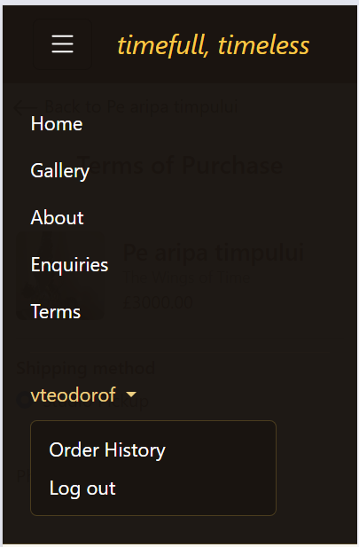
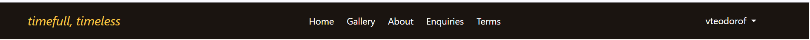
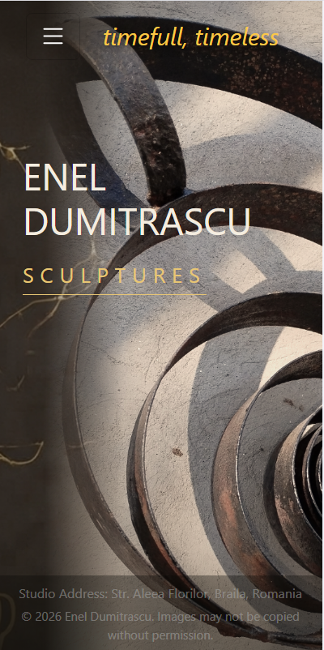
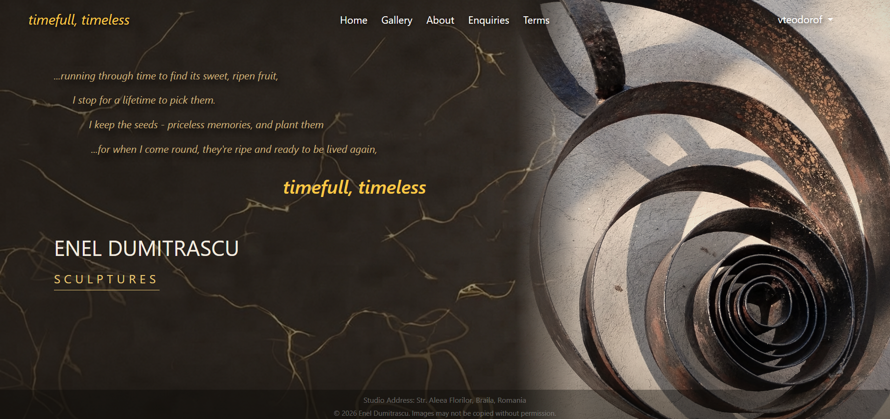
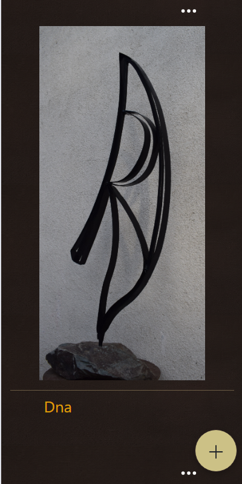
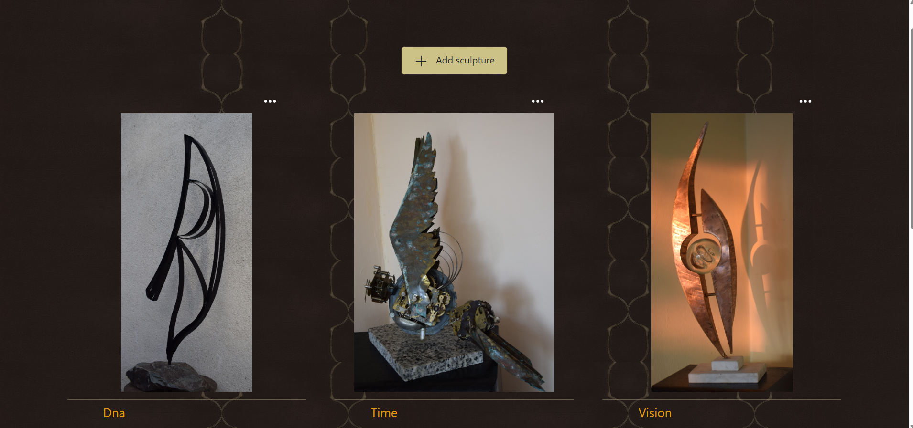
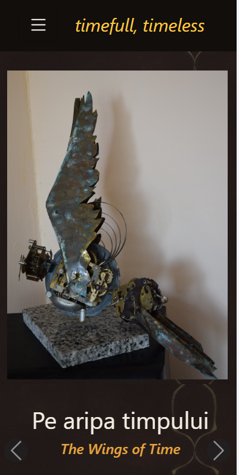
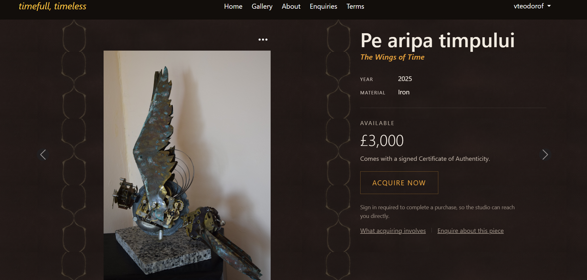
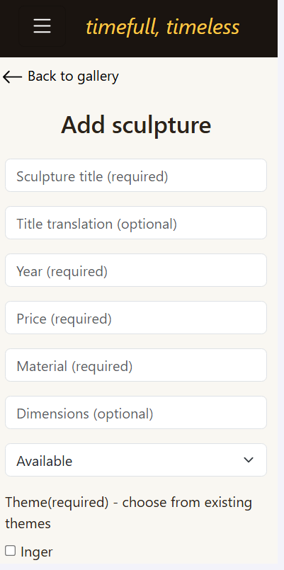
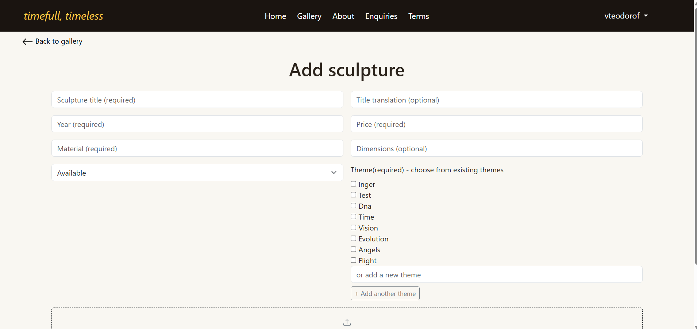

# TESTING.md - timefull-timeless

## Table of Contents

1. [Pass 1 - Automated Tests](#pass-1--automated-tests)
   - **gallery app**
     - [Theme and Sculpture Models](#theme-and-sculpture-models) - `gallery/tests/test_models.py`
     - [Gallery Views](#gallery-views) - `gallery/tests/test_views.py`
     - [Create and Edit Theme](#create-and-edit-theme)
     - [Gallery Forms](#gallery-forms) - `gallery/tests/test_forms.py`
   - **checkout app**
     - [Checkout Models](#checkout-models) - `checkout/tests/test_models.py`
     - [Checkout Views](#checkout-views) - `checkout/tests/test_views.py`
   - **pages app**
     - [Pages App - BusinessSettings Model](#pages-app--businesssettings-model) - `pages/tests/test_models.py`
     - [Pages App - ContactForm](#pages-app--contactform) - `pages/tests/test_forms.py`
     - [Pages App - Contact View](#pages-app--contact-view) - `pages/tests/test_views.py`
2. [Pass 2 — Manual Tests](#pass-2--manual-tests)
   - [Accessibility](#accessibility)
   - [Authentication (AUTH)](#authentication-auth)
   - [Responsiveness (RES)](#responsiveness-res)
     - [Navbar](#res--navbar)
     - [Homepage](#res--homepage)
     - [Gallery Page](#res--gallery-page)
     - [Sculpture Detail Page](#res--sculpture-detail-page)
     - [Add Sculpture Page](#res--add-sculpture-page)
   - [Navigation Links (NAV)](#navigation-links-nav)
   - [Gallery Page (GP)](#gallery-page-gp)
   - [Sculpture Detail (SD)](#sculpture-detail-sd)
   - [Theme Detail (TD)](#theme-detail-td)
   - [Permissions (PERM)](#permissions-perm)
   - [Empty States (EMPTY)](#empty-states-empty)
   - [Add Sculpture Form (ASF)](#add-sculpture-form-asf)
   - [Edit Sculpture Form (ESF)](#edit-sculpture-form-esf)
   - [Create and Edit Theme (CT)](#create-and-edit-theme-ct)
   - [Delete Sculpture Modal (DSM)](#delete-sculpture-modal-dsm)
   - [Terms Page (TP)](#terms-page-tp)
   - [Checkout Session Creation (CS)](#checkout-session-creation-cs)
   - [Webhook / Checkout Feedback](#webhook--checkout-feedback)
     - [Order Confirmation (OC)](#order-confirmation-oc)
     - [Owner Notification (ON)](#owner-notification-on)
   - [Contact Form (CF)](#contact-form-cf)
   - [Order History Page (OH)](#order-history-page-oh)
3. [Story-to-Test Mapping](#story-to-test-mapping)
4. [Solved Bugs](#solved-bugs)
5. [Known Bugs / Limitations](#known-bugs--limitations)
6. [Validation](#validation)
---


## Pass 1 — Automated Tests

### Theme and Sculpture Models

Model-level tests were written first (red), followed by the model implementation (green), following TDD. Tests are grouped by category
below rather than listed individually, given the volume of similar field-level checks.

| Category | Models Covered | Approx. Tests | Result |
|---|---|---|---|
| Field existence & type | Theme, Sculpture | ~20 | All pass |
| Nullability constraints (`null=True`/`False`) | Theme, Sculpture | ~12 | All pass |
| Uniqueness constraints (case-insensitive name/title, slug) | Theme, Sculpture | 4 | All pass |
| Validator boundaries (price, weight, year, insurance_rate_override) | Sculpture | 8 | All pass |
| Default values (status, is_visible, is_manually_reserved) | Sculpture | 3 | All pass |
| Slug auto-generation from name/title | Theme, Sculpture | 2 | All pass |
| Foreign key SET_NULL behaviour on delete | Theme ↔ Sculpture | 1 | All pass |
| ManyToMany relationship (themes ↔ sculptures) | Sculpture | 1 | All pass |
| Image field required-ness (CloudinaryField) | Sculpture | 2 | **Failed initially** — see note below |

### Notable finding: Sculpture.image (CloudinaryField)

I expected `Sculpture.objects.create(image=None)` to raise `IntegrityError`, since `image` is defined with `null=False`.

The test failed with no exception was raised. Investigation with Claude AI via the Django shell showed that `CloudinaryField` does not pass a true database `NULL` when given `None`; instead it substitutes an empty `CloudinaryResource` object (with `public_id=None`). Since something non-null is written to the row, the database's `NOT NULL` constraint is never violated.

Django's `null` check therefore never triggers on this field. What does catch a missing image is `full_clean()`'s **blank** check
(`image` does not have `blank=True`), since Django considers the empty `CloudinaryResource` "blank."

Two tests were written to capture this:

- One confirming `Sculpture.objects.create(image=None)` succeeds at the database level (documents the gap as expected, current
  behaviour of `CloudinaryField`).
- One confirming `full_clean()` raises `ValidationError` for a missing image (confirms required is enforced at the validation layer instead).

**Risk noted:** any code path that saves a `Sculpture` without calling `full_clean()` first (e.g. a direct `.objects.create()` or
`.save()` call outside a `ModelForm`) could silently save a sculpture with no real image, since the database itself will not reject it.


### Gallery Views

**File:** `gallery/tests/test_views.py`

**Gallery page** (`GalleryViewCase`)
- Anonymous and non-staff authenticated users cannot see the "Add sculpture" CTA
- Themes with no sculptures are excluded from the gallery view
- A theme with multiple sculptures appears only once (not duplicated per sculpture)
**Add Sculpture** (`AddSculptureViewCase`)
- URL resolves correctly
- Permission enforcement: anonymous->302, non-staff->403, staff->200
- Form is passed in context
- Valid data creates a `Sculpture` object and redirects to its detail page
- New theme creation, exact-duplicate reuse, case-insensitive duplicate reuse
- Multiple selected themes all attach correctly
- Existing-theme selection + new theme combine correctly
- Submission with no themes and no new theme fails validation
- Multiple `new_theme` fields (cloned) each create and attach their own theme
- New theme alone (no existing theme selected) submits successfully
**Edit Theme** (`EditThemeViewClass`)
- Permission enforcement: anonymous->302, non-staff->403
- GET request returns 400 (POST-only endpoint, no standalone page)
- Valid POST saves new name
- Valid POST saves `representative_sculpture`
- Empty name is rejected (400), no changes saved
**Edit Sculpture** (`EditSculptureViewClass`)
- Valid changed data saves and persists
- Successful edit redirects to sculpture's detail page
- **No permission tests** - see gap noted above
**Delete Sculpture** (`DeleteSculptureViewCase`)
- Permission enforcement: anonymous->302, non-staff->403
- A never-sold sculpture can be permanently deleted by staff, redirects to gallery
- A sold sculpture cannot be deleted, even by staff (403), sculpture persists


### Create and Edit Theme

- [x] AC1 - new theme created on valid submission
- [x] AC2 - new theme created and attached to the sculpture
- [x] AC3 - duplicate name (case-insensitive) reuses existing theme, no duplicate created - Exact-match test passing; different-case test exposed a genuine `IntegrityError` (duplicate slug), not just a clean assertion failure, since `get_or_create` only matches exact names while slug uniqueness is case-insensitive.
- [x] AC4 - form rejects submission when both theme fields are empty
- [x] AC6 - selecting multiple existing themes attaches all of them
- [x] AC7 - existing-theme selection and new-theme submission combine correctly
- [x] AC9 - multiple `new_theme` values (cloned fields) each create and attach a theme
- [ ] AC11 - theme survives sculpture deletion; card falls back to remaining sculpture
- [x] AC12 - empty theme hidden from gallery queryset; still included in form queryset
- [x] AC13 - edit-theme view rejects non-staff/anonymous requests (302/403/200)
- [x] AC15 - representative image override takes precedence over fallback, even when it wouldn't coincidentally match
- [x] AC16 - representative-image dropdown scoped to only this theme's sculptures, includes all of them
- [x] AC17 - rename validation excludes self (no false duplicate on unchanged save), rejects name matching a different theme
- [ ] AC19 - untagging a sculpture from a theme clears a stale representative-image override
- [x] AC21 - view calls `messages.success` on theme-related success paths


### Gallery Forms

**File:** `gallery/tests/test_forms.py`

**SculptureForm**
- Form has all expected fields, in expected order (`title`, `title_translation`, `dimensions`, `year`, `material`, `price`, `themes`, `image`, `status`, `new_theme`)
- Form has a distinct, non-model `new_theme` field
**ThemeForm**
- `representative_sculpture` field's queryset is correctly scoped to only sculptures belonging to the theme being edited (matches AC16 above), excluding sculptures from other themes


---

### Checkout Models

**File:** `checkout/tests/test_models.py`

**Order**
- `order_number` exists, `max_length=32`, marked non-editable
- `shipping_method` offers exactly `delivery` and `pickup` as choices
- `postcode` is nullable
- `shipped_at` is nullable
- `order_number` auto-generates on save
**OrderLineItem**
- `order` and `sculpture` are both `ForeignKey` fields
- `delivery_cost` defaults to `0` (Studio Pickup orders have no delivery cost)
- `lineitem_total` is marked non-editable (always calculated, never user-entered)
- `lineitem_total` calculates correctly as `price_at_purchase + insurance_cost + delivery_cost`

---

### Checkout Views

**File:** `checkout/tests/test_views.py`

**Create Checkout Session** (`CreateCheckoutSessionTests`)
- Direct POST to create-checkout-session for an already-sold sculpture (bypassing the terms page) is blocked - redirects to sculpture detail, no Stripe session created
**Stripe Webhook** (`StripeWebhookTests`)
- An invalid `Stripe-Signature` header is rejected with 400, event not processed
**Order History** (`OrderHistoryViewTests`)
- Anonymous request redirected to login (302)
- Authenticated user sees their own order in history
- Authenticated user does NOT see another user's order in history

---

### Pages App — BusinessSettings Model

**File:** `pages/tests/test_models.py`

- `load()` creates a new row with the default insurance rate (0.015) when none exists yet
- `load()` returns the existing row (including saved edits) rather than creating a duplicate
- `save()` pins the primary key to `1` regardless of how the instance was created — this is the actual mechanism enforcing singleton behaviour
- `delete()` has no effect; the row persists, since deletion is intentionally disabled to protect the single row

---

### Pages App — ContactForm

**File:** `pages/tests/test_forms.py`

Uses a test data builder pattern (`valid_data(**overrides)`) to isolate one variable per test.

- Missing `phone` (optional) — valid
- Missing `name` — invalid, error on `name`
- Missing `email` — invalid, error on `email`
- Malformed `email` — invalid, error on `email`
- Missing `subject` (optional) — valid
- Missing `message` — invalid, error on `message`
- All fields valid — submits successfully

---

### Pages App — Contact View

**File:** `pages/tests/test_views.py`

- Valid POST redirects back to the contact page
- Invalid POST re-renders the form with errors, without redirecting (status 200)
- Anonymous GET request has no prefilled email
- Authenticated GET request prefills email with the logged-in user's registered address

---

## Pass 2 — Manual Tests

### Accessibility

| Test ID | Test | Expected | Actual | Local | Deployment |
|---|---|---|---|---|---|
| A11Y-01 | Homepage hero background image has screen-reader-accessible description (manual) | Visually-hidden text describing image is present | As expected | Pass | Pass |
| A11Y-02 | Theme cards alt text | Present for each them card | As expected | Pass | Pass |
| A11Y-03 | Sculpture image alt text | Present for each sculpture image | As expected | Pass | Pass |
| A11Y-04 | Alt="" on purely decorative images | No decorative images only except for background tiles, set as background images | As expected | Pass | Pass |
| A11Y-05 | Add sculpture button on mobile | Aria-label present on <a> | As expected | Pass | Pass |
| A11Y-06 | Burger menu icon | Aria-label present on icon | As expected | Pass | Pass |
| A11Y-07 | Three dots edit theme button | Aria-label added | As expected | Pass | Pass |
| A11Y-08 | Three dots edit sculpture button | Aria-label present | As expected | Pass | Pass |
| A11Y-09 | Upload image SVG paired with text | Aria-hidden true added | As expected | Pass | Pass |
| A11Y-10 | Add sculpture form labels | Visually hidden labels for matching fields present | As expected | Pass | Pass |
| A11Y-11 | Edit theme and delete sculpture close modal buttons | Aria-label added | As expected | Pass | Pass |
| A11Y-12 | All forms labels | Matching `for` attributes added to labels on all forms | As expected | Pass | Pass |
| A11Y-13 | Heading hierarchy | All pages have a `h1` heading and no skip subsequent headings | As expected | Pass | Pass |
| A11Y-14 | Lists | All lists are properly marked as such | As expected | Pass | Pass |
| A11Y-15 | Fieldsets | Form fields are wrapped in fieldsets with `legend` when logically grouped | As expected | Pass | Pass |
| A11Y-16 | Links | Distinguishable by more than colour | As expected | Pass | Pass |
| A11Y-17 | Required fields in forms | Distinguishable by text or non-colour symbol | As expected | Pass | |
| A11Y-18 | Tab order | All interactive elements reachable in logical order by tab navigation | As expected | Pass | Pass |
| A11Y-19 | `title` on every page | Accurately describes page content | As expected | Pass | Pass |

---

### Authentication (AUTH)


| Test ID | Test | Expected | Actual | Local | Deployment |
|---------|------|----------|-------|-------|------------|
| AUTH-01 | Sign up with valid data | Loads Confirm Emai page | As expected | Pass | Pass |
| AUTH-02 | Paste confirmation link url in browser (obtained via console backend) | Loads "Confirm Email Address" page showing correct email/username | As expected | Pass | Not applicable |
| AUTH-03 | Click Confirm button on that page | Email is marked verified; redirects to Sign in page  | As expected | Pass | Pass |
| AUTH-04 | Submit signup with honeypot field (`phone_number`) filled in (simulating a bot) | Signup appears to succeed (fake success page shown) but no user account is actually created | Does not apply for this MVP | | |
| AUTH-05 | Attempt login before confirming email | Login blocked; redirected to Confirm Email page rather than logged in | As expected - redirected to Confirm Email page, login refused | Pass | Pass|
| AUTH-06 | Login with valid credentials (username) from a verified account | Logs in and redirects to home page | As expected | Pass | Pass |
| AUTH-07 | Login with valid credentials (email) from a verified account | Logs in and redirects to home page | As expected | Pass | Pass |
| AUTH-08 | Request password reset with a registered email | Loads "password reset sent" confirmation page | As expected | Pass | Pass |
| AUTH-08 | Click reset link from console output typed into browser | Loads "set new password" form | As expected | Pass | |
| AUTH-09 | Submit new password on that form | Password updated; redirected to reset-complete page | As expected | Pass | Pass |
| AUTH-09 | Log in with the new password | Login succeeds | As expected | Pass | Pass |
| AUTH-10 | Attempt to reuse the same reset link a second time | Link rejected | As expected | Pass | Pass |
| AUTH-11 | Sign up with mismatched email and email confirmation fields | Form rejected with validation error; no account created | As expected | Pass | Pass |
| AUTH-12 | Sign up with mismatched password and password confirmation fields | Form rejected with validation error; no account created | As expected | Pass | Pass |
| AUTH-13 | Sign up with a username shorter than the minimum length | Form rejected with validation error; no account created | As expected | Pass | Pass |
| AUTH-14 | Sign up with an email already registered to an existing account | Form rejected with validation error; no account created | As expected | Pass | Pass |
| AUTH-15 | Sign up with a username already taken by an existing account | Form rejected with validation error; no account created | As expected | Pass | Pass |
| AUTH-16 | Sign up with valid data using a real, accessible inbox, check that inbox | Confirmation email arrives in the real inbox, addressed to the exact email entered, with a working confirmation link | As expected | Pass | Pass |
| AUTH-17 | Click confirmation link from a real email client | Link opens and loads the Confirm Email Address page correctly, showing the right email/username | As expected | | Pass |
| AUTH-18 | Submit login with valid username but wrong password | Login rejected; clear error shown; user remains logged out | As expected | Pass | Pass |
| AUTH-20 | Submit login with a username/email that doesn't exist | Login rejected; clear error shown; user remains logged out | As expected | Pass | Pass |
| AUTH-21 | Submit login with a username/email that doesn't exist | Login rejected; clear error shown; user remains logged out | As expected | Pass | Pass |
| AUTH-22 | Login and signup form fields render with `form-control` styling | Fields show Bootstrap border/padding, not unstyled defaults | As expected | Pass | Pass |
| AUTH-23 | Login and signup fields show no placeholder text | Only labels shown; no placeholder duplicating the label | As expected | Pass | Pass |
| AUTH-24 | "Remember Me" checkbox styling (login) | Renders as a standard small checkbox (`form-check-input`), not stretched/deformed | As expected | Pass | Pass |
| AUTH-25 | "All fields are required" note (signup) | Displayed once, near the top of the form | As expected | Pass | Pass |
| AUTH-26 | Password help text (signup) | Not shown; error only appears if password fails validation on submit | As expected | Pass | Pass |
| AUTH-27 | Logged-in/logged-out flash messages | Suppressed; no default allauth message shown after login or logout | As expected | Pass | Pass |


### Responsiveness (RES)

Responsiveness is checked per page across breakpoints, with screenshots included as evidence

**Navbar**

| Test ID | Test | Expected | Actual | Local | Deployment |
|---------|------|----------|--------|-------|------------|
| RES-01 | Burger visible on mobile (<992px) | Burger icon shown, links hidden | As expected | Pass | Pass |
| RES-02 | Burger hidden on desktop (≥992px) | Burger hidden, links inline | As expected | Pass | Pass |
| RES-03 | Burger drawer opens on tap | Collapse expands, links + auth block visible | As expected | Pass |Pass |
| RES-04 | Burger drawer closes on second tap | Collapses drawer | As expected | Pass  | Pass |
| RES-05 | Username shown when authenticated (desktop) | Username replaces Sign in/Sign up | As expected | Pass | Pass |
| RES-06 | Dropdown opens on username click/tap (mobile + desktop) | Order History / Log out appear | As expected | Pass | Pass |
| RES-07 | Dropdown closes on second click/tap (mobile + desktop) | Dropdown closes | As expected | Pass | Pass |

<p align="center">
  
  
</p>


#### Homepage

| Test ID | Test | Expected | Actual | Local | Deployment |
|---------|------|----------|--------|-------|------------|
| RES-08 | Hero poem visibility on mobile (<768px) | Poem hidden (`d-none`), hero wordmark and name block still shown | As expected | Pass | Pass |
| RES-09 | Hero poem visibility on desktop (≥768px) | Poem visible above the wordmark | As expected | Pass | Pass |
| RES-10 | Layout at mobile width | Hero content remains legible, no overlap with background image | As expected | Pass | Pass |
| RES-11 | Layout at desktop width | Full hero composition (poem, wordmark, name, background image) displays as designed | As expected | Pass | Pass |

<p align="center">
  
  
</p>


#### Gallery Page

| Test ID | Test | Expected | Actual | Local | Deployment |
|---------|------|----------|--------|-------|------------|
| RES-12 | Column count at desktop width | Theme cards arrange into 3 columns for tablet and disktop | As expected | Pass | Pass |
| RES-13 | Column count at mobile width | Theme cards arrange into one column for mobile | As expected | Pass | Pass |
| RES-14 | "Add sculpture" button on mobile viewport | Displays as a persistent, round FAB in the lower-right corner | As expected | Pass | Pass |
| RES-15 | "Add sculpture" button on desktop viewport | Displays inline, centered, content-sized, positioned between quote and theme cards | As expected | Pass | Pass |

<p align="center">
  
  
</p>


#### Sculpture Detail Page

| Test ID | Test | Expected | Actual | Local | Deployment |
|---------|------|----------|--------|-------|------------|
| RES-16 | Layout at mobile width | Image and details stack in a single column | As expected | Pass | Pass |
| RES-17 | Layout at desktop width (≥768px) | Image and details render in two columns (image left, details right) |As expected | Pass | Pass |
| RES-18 | Layout transition across breakpoint | Resizing across 768px switches cleanly between stacked and two-column, no overlap or broken spacing | As expected | Pass | Pass |

<p align="center">
  
  
</p>

#### Add Sculpture Page

| Test ID | Test | Expected | Actual | Local | Deployment |
|---------|------|----------|--------|-------|------------|
| RES-21 | Layout at mobile width | Form fields stack in a single column, remain legible and usable | As expected | Pass | Pass |
| RES-22 | Layout at desktop width | Fields arrange per the two-column (`col-md-6`) layout | As expected | Pass | Pass |
| RES-23 | Themes multi-select tap target size on mobile | **Known gap, not yet verified** — unclear whether individual theme options have sufficient tappable space on small screens | | | |

<p align="center">
  
  
</p>


#### Navigation links (NAV)

| Test ID | Test | Expected | Actual | Local | Deployment |
|---------|------|----------|--------|-------|------------|
| NAV-00 | Logo | Navigates to home page | As expected | Pass | Pass |
| NAV-01 | Home link | Navigates to home page | As expected | Pass | Pass |
| NAV-02 | Gallery link | Navigates to gallery page | As expected | Pass | Pass |
| NAV-03 | About link | Navigates to about page | As expected | Pass | Pass |
| NAV-04 | Enquiries link | Navigates to enquiries page | As expected | Pass | Pass |
| NAV-05 | Sign in link (guest) | Navigates to login page | As expected | Pass | Pass |
| NAV-06 | Sign up link (guest) | Navigates to signup page | As expected | Pass | Pass |
| NAV-07 | Order History link (authenticated) | Navigates to order history | As expected | Pass | Pass |
| NAV-08 | Log out link (authenticated) | Logs out, redirects to home page | As expected | Pass | Pass |
| NAV-09 | Terms link | Navigates to terms page | As expected | Pass | Pass |
| HP-01 | Click "SCULPTURES" text on home page | Navigates to gallery page | As expected | Pass | Pass |


### Gallery page (GP)

| Test ID | Test | Expected | Actual | Local | Deployment |
|---------|------|----------|--------|-------|------------|
| GP-01 | Click "Add sculpture" button (staff) | Navigates to add sculpture page | As expected | Pass | Pass |
| GP-02 | Hover over "Add sculpture" button (staff) | Pointer cursor confirms interactivity; no additional hover state (color/shadow) — accepted, given clear text label | As expected | Pass | Pass |
| GP-03 | Hover over theme-card edit button (staff) | Color and background change on hover, confirming interactivity | As expected | Pass | Pass |
| GP-04 | Click theme-card edit button (staff) | Opens edit theme modal | As expected | Pass | Pass |
| GP-05 | Hover over theme card image | Image scales up (zoom), pointer cursor shown, confirming card is clickable | As expected | Pass | Pass |
| GP-06 | Click theme card image/link | Navigates to that theme's detail (carousel) page | As expected | Pass | Pass |
| GP-07 | Hover/click theme name caption text | Pointer cursor shown; click navigates to that theme's detail (carousel) page | As expected | Pass | Pass |


### Sculpture Detail (SD)

| Test ID | Test | Expected | Actual | Local | Deployment |
|---------|------|----------|--------|-------|------------|
| SD-01 | Hover over actions dropdown button (staff) | Color and background change on hover, confirming interactivity — same as theme-card edit button | As expected | Pass | Pass |
| SD-02 | Click actions dropdown button (staff) | Dropdown opens, showing Edit (and Delete, if not sold) | As expected | Pass | Pass |
| SD-03 | Dropdown contents for an available sculpture (staff) | Both "Edit" and "Delete" options present | As expected | Pass | Pass |
| SD-04 | Dropdown contents for a sold sculpture (staff) | Only "Edit" option present; "Delete" hidden | As expected | Pass | Pass |
| SD-05 | Click "Edit" in the actions dropdown | Navigates to that sculpture's edit page | As expected | Pass | Pass |
| SD-06 | Click "Delete" in the actions dropdown | Confirmation modal opens, asking to confirm before proceeding | As expected | Pass | Pass |
| SD-07 | Hover over "Acquire Now" link | Text color and border color both change, confirming interactivity | As expected | Pass | Pass |
| SD-08 | Click "What acquiring involves" link | Navigates to the static Terms page | As expected | Pass | Pass |
| SD-09 | Click "Enquire about this piece" link | Navigates to the contact page | As expected | Pass | Pass |
| SD-10 | "Acquire Now" button visibility by status | Shown when sculpture is available; hidden when sculpture is sold | As expected | Pass | Pass |
| SD-11 | Title translation display | Shown when `title_translation` is set; hidden entirely when not set | As expected | Pass | Pass |
| SD-12 | Meta fields display (year, material, dimensions) | Year and material always shown; dimensions shown only when set, hidden entirely when not | As expected | Pass | Pass |
| SD-13 | Price formatting | Displayed with comma separator for large values (e.g. £3,000, not £3000) | As expected | Pass | Pass |

---

### Theme Detail (TD)

| Test ID | Test | Expected | Actual | Local | Deployment |
|---------|------|----------|--------|-------|------------|
| TD-01 | Click carousel prev/next control | Current slide fades out, next/prev sculpture's slide fades in | As expected | Pass | Pass |
| TD-02 | Prev/next control position stability across slides with different image aspect ratios | Does not shift position | Minor position shift observed occasionally; not visually disruptive, accepted as-is | Pass | Pass |

---


### Permissions (PERM)

**Gallery page**

| Test ID | Test | Expected | Actual | Local | Deployment |
|---------|------|----------|--------|-------|------------|
| PERM-01 | Anonymous user, "Add sculpture" button | Not visible | As expected | Pass | Pass |
| PERM-02 | Authenticated non-staff user, "Add sculpture" button | Not visible | As expected | Pass | Pass |
| PERM-03 | Staff user, "Add sculpture" button | Visible | As expected | Pass | Pass |
| PERM-04 | Anonymous user, theme-card edit button | Not visible | As expected  | Pass | Pass |
| PERM-05 | Authenticated non-staff user, theme-card edit button | Not visible | As expected | Pass | Pass |
| PERM-06 | Staff user, theme-card edit button | Visible | As expected | Pass | Pass |

**Add Sculpture page**

| Test ID | Test | Expected | Actual | Local | Deployment |
|---------|------|----------|--------|-------|------------|
| PERM-07 | Anonymous user visits `/gallery/add_sculpture/` directly | Redirects to login page | As expected | Pass | Pass |
| PERM-08 | Authenticated non-staff user visits `/gallery/add_sculpture/` directly | Gets 403 response | As expected  | Pass | Pass |
| PERM-09 | Staff user visits `/gallery/add_sculpture/` directly | Page loads successfully | As expected | Pass | Pass |

**Sculpture Detail page**

| Test ID | Test | Expected | Actual | Local | Deployment |
|---------|------|----------|--------|-------|------------|
| PERM-10 | Anonymous user, actions dropdown (edit/delete) | Not visible | As expected | Pass | Pass |
| PERM-11 | Authenticated non-staff user, actions dropdown | Not visible | As expected | Pass | Pass |
| PERM-12 | Staff user, actions dropdown | Visible | As expected | Pass | Pass |

---

#### Empty states (EMPTY)

| Test ID | Test | Expected | Actual | Local | Deployment |
|---------|------|----------|--------|-------|------------|
| EMPTY-01 | Gallery page empty state content | Empty message for regular users, plus Add Sculpture button for staff controls | As expected | Pass | |
| EMPTY-02 | Gallery page non-empty state content | theme card grid renders when at least one sculpture exists | As exptected  | Pass | Pass |


#### Add Sculpture Page

| Test ID | Test | Expected | Actual | Local | Deployment |
|---------|------|----------|--------|-------|------------|
| ASP-01 | Page title | "Add sculpture" heading renders | As expected | Pass | |
| ASP-02 | Back link presence | Back-to-gallery affordance renders at top of form | As expected | Pass | |
| ASP-03 | Back link destination | Clicking back link navigates to gallery page | As expected | Pass | |
| ASP-04 | Unsaved changes warning | Navigating away with unsaved input shows confirmation | | | |


#### Add Sculpture Form (ASF)

| Test ID | Test | Expected | Actual | Local | Deployment |
|---------|------|----------|--------|-------|------------|
| ASF-01 | All form fields present | Title, title translation, dimensions, year, material, price, status, theme (dropdown + new-theme text), image upload all render | As expected | Pass | Pass |
| ASF-02 | Save buttons present | "Save" button present | As expected | Pass | Pass |
| ASF-03 | Required fields | Clearly marked as such | Consistent marking | Pass | Pass |
| ASF-04 | Click the status dropdown on create/edit form | Dropdown opens showing two choices (Available, Sold); hovering over an option shows a visible hover state; clicking an option selects it and closes the dropdown, showing the selected value in the field | As expected | Pass | Pass |
| ASF-05 | Click the image upload box/button on create form | File picker dialog opens, allowing the user to select an image from their device | As exptected | Pass | Pass |
| ASF-06 | Select an image file in the file picker | File picker closes; a visual indicator or message confirms the file was selected/attached | File name shown | Pass | Pass |
| ASF-07 | Hover over form button (Save) | Button shows a visible hover state indicating it's interactive | As expected | Pass | Pass |
| ASF-08 | Submit form with all valid data | Form saves; a success message/confirmation is shown to the user | As expected | Pass | Pass |
| ASF-09 | Submit form with invalid/missing data | Form does not save; relevant, clear error message(s) shown next to the failing field(s) | As expected | Pass | Pass |
| ASF-10 | Save a valid sculpture as staff/sculptor, then view the gallery | Newly saved sculpture appears in the public gallery | As expected | Pass | Pass |
| ASF-11 | View detail page immediately after successful add | Title, translation, year, material, dimensions, price, status, and image all display exactly as entered | As expected | Pass | Pass |

#### Edit Sculpture Form (ESF)

| Test ID | Test | Expected | Actual | Local | Deployment |
|---|---|---|---|---|---|
| ESF-01 | All form fields present, pre-populated | Title, title translation, dimensions, year, material, price, status, themes, image all render, pre-filled with the sculpture's current values | As expected | Pass | Pass |
| ESF-02 | Save button present | "Save" button renders | As expected | Pass | Pass |
| ESF-03 | Required fields | All required fields prefilled with current values on load; if cleared, placeholder text indicates the field is required, consistent with Add Sculpture form | As expected | Pass | Pass |
| ESF-04 | Click the status dropdown | Dropdown opens showing choices; hovering shows a visible hover state; clicking an option selects it and closes the dropdown, showing the selected value | As expected | Pass | Pass |
| ESF-05 | Click the image upload/change box | File picker dialog opens, allowing selection of a new image | As expected | Pass | Pass |
| ESF-06 | Select a new image file in the file picker | File picker closes; a visual indicator confirms the new file was selected | As expected | Pass | Pass |
| ESF-07 | Leave image field untouched, submit other valid changes | Existing image is preserved; submission succeeds without requiring re-upload | As expected | Pass | Pass |
| ESF-08 | Hover over Save button | Button shows a visible hover state indicating it's interactive | As expected | Pass | Pass |
| ESF-09 | Submit form with all valid changed data | Form saves; success message shown; redirected to sculpture's detail page reflecting the changes | As expected  | Pass | Pass |
| ESF-10 | Submit form with invalid/missing data | Form does not save; relevant, clear error message(s) shown next to the failing field(s) | As expected | Pass | Pass |
| ESF-11 | Change title to one matching another existing sculpture's title (same casing) | Form rejects submission; validation error shown | As expected | Pass | Pass |
| ESF-12 | Change title to one matching another existing sculpture's title (different casing) | Form rejects submission; validation error shown | As expected | Pass | Pass |
| ESF-13 | Submit with title unchanged (same as sculpture's own current title) | Form saves successfully; no false "duplicate title" error against itself | As expected | Pass | Pass |
| ESF-14 | View detail page immediately after successful edit | Title, translation, year, material, dimensions, price, status, and image all display exactly as edited | As expected | Pass | Pass |
| ESF-15 | Cancel link | Clicking "Cancel" navigates to the sculpture's detail page without saving any changes | As expected | Pass | Pass |
| ESF-16 | Unselect the sculpture's existing theme, submit a new theme name instead | Sculpture ends up attached only to the new theme; old theme association is removed | Bug found and fixed; now works as expected | Pass | |
| ESF-17 | Leave the sculpture's existing theme selected, also submit a new theme name | Sculpture ends up attached to both the existing theme and the new one | As expected | Pass | |


#### Create and Edit Theme (CT)

| Test ID | Test | Expected | Actual | Local | Deployment |
|---------|------|----------|--------|-------|------------|
| CT-01 | New theme appears in multi-select after creation | Creating a sculpture with a new theme name; visiting edit-sculpture afterward shows the new theme as an option in the multi-select | As expected | Pass | Pass |
| CT-02 | New theme correctly associated with its sculpture | Creating a sculpture with a new theme name; sculpture detail/gallery shows the new theme correctly associated | As expected | Pass | Pass |
| CT-03 | Duplicate new theme name (exact match) | Submitting a new theme name exactly matching an existing theme; no error shown, no duplicate choice, submission succeeds normally | As expected | Pass | Pass |
| CT-04 | Duplicate new theme name (different casing) | Submitting a new theme name matching an existing theme with different casing; no error shown, submission succeeds normally | As expected | Pass | Pass |
| CT-05 | Both theme fields left empty | Submitting the add-sculpture form with both theme fields empty; clear validation error shown near the right place, other entered fields preserved | As expected | Pass | Pass |
| CT-06 | Success/error feedback messages | A theme-related validation error shows a clear error message; editing an existing theme shows a success message on save | As expected | Pass | Pass |
| CT-07 | Select multiple existing themes | Physically selecting two or more themes in the multi-select; interaction feels right, selected state is visually clear | As expected | Pass | Pass |
| CT-08 | Combine existing theme selection with a new theme | Selecting an existing theme and typing a new theme name in the same submission; both end up visible together on the sculpture and gallery | As expected | Pass | Pass |
| CT-09 | Zero themes - form state | With zero themes in the database, the themes multi-select is not displayed on the add-sculpture form, and the "new theme" field's placeholder reflects this is the first theme(s) | As expected | Pass | Pass |
| CT-10 | "+" button clones new theme field | Clicking the "+" button adds an additional "new theme" field in the browser (one theme name per field) | As expected | Pass | Pass |
| CT-11 | New theme(s) appear as gallery cards | After adding a sculpture with one or more new themes, the gallery page shows each as its own card, displaying the sculpture's image | As expected | Pass | Pass |
| CT-12 | Edit button visible only to staff | Staff user sees the edit menu (both labeled options) on each theme card; anonymous/non-staff users do not see it | As expected | Pass | Pass |
| CT-13 | Edit button opens modal populated correctly | Clicking the three-dot button on a theme card opens the edit modal, pre-filled with that specific theme's name, representative-image options | As expected | Pass | Pass |
| CT-14 | Representative image override reflected in gallery | Selecting a different sculpture as the theme's representative image and saving; gallery card shows the selected sculpture's image | As expected | Pass |Pass |
| CT-15 | Theme name field pre-populated | Theme-edit page's name field exists and is pre-populated with the current name on load | As expected | Pass | Pass |
| CT-16 | Renamed theme reflected in gallery | Renaming a theme and saving; gallery card displays the new name | As expected | Pass | |
| CT-17 | Cancel button clicked closes modal without saving | Theme-edit modal has a "Cancel" button;  clicking it closes the modal, nothing is saved | As expected | Pass | Pass |
| CT-18 | Themes casing | Consistent casing for themes in multiselect fields and theme cards | As expected | Pass | |
| CT-19 | Themes displayed in multiselect fields | All themes are displayed in multiselect fields regardless of whether there are any sculptures with that theme or not | as expected | Pass | Pass |
| CT-20 | Non-empty themes gallery cards | Gallery displays one card per theme when this is not empty | As expected | Pass | Pass |
| CT-21 | Representative image default | The image of the latest added sculpture in a theme is displayed as representative image for that theme when no other is manually selected | As expected | Pass | Pass |
| CT-22 | Representative image across multiple themes | A single sculpture tagged with multiple themes displays as the representative image on each of those themes cards independently | As expected | Pass | Pass |
| CT-23 | Theme card updates after its featured sculpture is removed | Removing a sculpture that was shown on a theme's card; that theme still exists, and its card now shows a different remaining sculpture instead | As expected | Pass | Pass |
| CT-24 | Empty theme still selectable in sculpture form | A theme with no sculptures assigned still appears as an option in the themes multi-select on the add-sculpture form | As expected | Pass | Pass |
| CT-25 | Representative image respects manual selection over most-recent fallback | Manually selecting an *older* sculpture as a theme's representative image and saving; gallery card shows the manually selected (older) sculpture, not the most recent one | Bug found and fixed (`get_representative_image` previously ignored `representative_sculpture`); now works as expected | Pass | Pass |

---

### Delete Sculpture Modal (DSM)

| Test ID | Test | Expected | Actual | Local | Deployment |
|---------|------|----------|--------|-------|------------|
| DSM-01 | Modal shows the correct sculpture name | Modal displays the specific sculpture's title, confirming the correct piece before deletion | As expected | Pass | Pass |
| DSM-02 | Confirm deletion | Sculpture is permanently deleted, success message shown, redirected to gallery page | As expected | Pass | Pass |
| DSM-03 | Cancel deletion in modal | Modal closes, nothing is deleted, sculpture remains unchanged | As expected | Pass | Pass |

---

## Contact Form (CF)

| Test ID | Test | Expected | Actual | Local | Deployment |
|---|---|---|---|---|---|
| CF-01 | Missing `name` | Form rejected, error on `name` shown | As expected | Pass | Pass |
| CF-02 | Missing `email` | Form rejected, error on `email` shown | As expected | Pass | Pass |
| CF-03 | Malformed `email` | Form rejected, error on `email` shown | As expected | Pass | Pass |
| CF-04 | Missing `message` | Form rejected, error on `message` shown | As expected | Pass | Pass |
| CF-05 | Missing `phone` (optional) | Form submits successfully | As expected | Pass | Pass |
| CF-06 | Missing `subject` (optional) | Form submits successfully | As expected | Pass | Pass |
| CF-07 | All fields valid | Form submits successfully | As expected | Pass | Pass |
| CF-08 | Form submited with valid data | Redirects to contact page, confirmation message shown | As expected | Pass | Pass |
| CF-09 | Anonymous user | Contact form loads with empty email field | As expected | Pass | Pass |
| CF-10 | Authenticated user | Contact form loads with email field prefilled with registered address | As expected | Pass | Pass |
| CF-11 | Recipient receives enquiry | Upon successful submission business owner receives email enquiry | As expected | Pass | Pass |

---

## Terms Page (TP)

| Test ID | Test | Expected | Actual | Local | Deployment |
|---|---|---|---|---|---|
| TP-01 | Click "Acquire Now" on a sculpture detail page, logged in | Navigates to terms page for that sculpture | As expected | Pass | Pass |
| TP-02 | Click "Acquire Now" while logged out | Redirected to login page | As expected | Pass | Pass |
| TP-03 | Log in after being redirected from "Acquire Now" | Redirected to the terms page for the original sculpture, not to a generic page | As expected | Pass | Pass |
| TP-04 | Terms page loads | Sculpture name and price shown correctly, matching the sculpture clicked | As expected | Pass | Pass |
| TP-05 | "Back to [sculpture]" link present | Renders near the top of the page | As expected | Pass | Pass |
| TP-06 | Click "Back to [sculpture]" link | Navigates to that sculpture's detail page | As expected | Pass | Pass |
| TP-07 | Select "Studio Pickup" | Country options hidden/not shown; delivery cost line shows £0 | As expected | Pass | Pass |
| TP-08 | Select "Delivery" | Country choice (UK/Romania) becomes visible | As expected | Pass | Pass |
| TP-09 | Select "Delivery" then "United Kingdom" | Delivery cost shows £40.00; total updates correctly | As expected | Pass | Pass
| TP-10 | Select "Delivery" then "Romania" | Delivery cost shows £15.00; total updates correctly | As expected | Pass | Pass |
| TP-11 | Cost breakdown - Sculpture line | Matches the sculpture's actual price | As expected | Pass | Pass |
| TP-12 | Cost breakdown - Insurance line | Insurance value equals sculpture price × BusinessSettings.insurance_rate (e.g. £100 sculpture × 1.5% = £1.50), rounded to 2 decimal places | As expected | Pass | Pass |
| TP-13 | Cost breakdown — Total | Equals Sculpture + Insurance + Delivery (or Sculpture + Insurance if Pickup) | As expected | Pass | Pass |
| TP-14 | VAT disclosure text present | Renders above the payment button, mentions VAT explicitly | As expected | Pass | Pass |
| TP-15 | Click "Terms and Conditions" link within VAT disclosure | Navigates to static Terms page | As expected | Pass | Pass |
| TP-19 | Anonymous user attempts to access terms page URL directly | Redirected to login | As expected | Pass | Pass |
| TP-20 | Non-staff authenticated user accesses terms page for a valid sculpture | Page loads normally | As expected | Pass | Pass|
| TP-21 | Access terms page (via button or direct URL) for a sculpture with `status='sold'` | Redirected away to sculpture detail with a message, rather than allowed to proceed | As expected | Pass | Pass |
| TP-22 | Phone number field present on terms page | Renders between shipping method choice and cost breakdown, clearly marked optional | As expected | Pass | Pass |
| TP-23 | Submit form with phone number field left blank | Form submits successfully (optional field, no validation error) | As expected | Pass | Pass |
| TP-24 | Submit form with a phone number entered | Value is passed through to the Checkout Session's metadata correctly | As expected | Pass | Pass |

## Checkout Session Creation (CS)

| Test ID | Test | Expected | Actual | Local | Deployment |
|---|---|---|---|---|---|
| CS-01 | Submit terms form with "Studio Pickup" selected | Redirects to Stripe's hosted checkout page | As expected | Pass | Pass |
| CS-02 | Stripe checkout page - line items shown | Sculpture and Insurance line items appear with correct names and amounts | As expected | Pass | Pass |
| CS-03 | Stripe checkout page - total | Total matches Sculpture + Insurance (no delivery line for Pickup) | As expected | Pass | Pass |
| CS-04 | Stripe checkout page - email prefilled | Buyer's email is prefilled and matches their account email | As expected | Pass | Pass |
| CS-05 | Submit terms form with "Delivery" + "United Kingdom" selected | Redirects to Stripe's hosted checkout page, with a Delivery (UK) line item and a shipping address form | As expected | Pass | Pass |
| CS-06 | Submit terms form with "Delivery" + "Romania" selected | Redirects to Stripe's hosted checkout page, with a Delivery (RO) line item and a shipping address form | As expected | Pass | Pass |
| CS-07 | Complete payment on Stripe's hosted page using test card 4242 4242 4242 4242 | Payment succeeds; redirected to /checkout/success/ | As expected | Pass | Pass |
| CS-08 | Success page after payment | Displays confirmation message, matches site branding (nav/footer intact) | As expected | Pass | Pass |
| CS-09 | Sculpture status after successful test payment | Status changes to `sold` | | | |
| CS-10 | Attempt to POST directly to create-session URL for a sold sculpture | Redirected away with a message, rather than a Stripe session being created | as expected | Pass | Pass |

## Webhook / Checkout Feedback

### Order Confirmation (OC)

| Test ID | Test | Expected | Actual | Local | Deployment |
|---|---|---|---|---|---|
| OC-01 | Complete a successful payment on Stripe's hosted page | Redirected to branded success page | As expected | Pass | |
| OC-02 | Webhook processes a confirmed `checkout.session.completed` event | Confirmation email sent to the buyer's verified account email | As expected | Pass | |
| OC-04 | Webhook event fails signature verification | No confirmation email is sent | As expected | Pass | |

### Owner Notification (ON)

| Test ID | Test | Expected | Actual | Local | Deployment |
|---|---|---|---|---|---|
| ON-01 | Webhook processes a confirmed event | Email sent to the business owner containing sculpture name, buyer details, shipping method (and country, if delivery), and order total | As expected | Pass | Pass |
| ON-02 | Business owner logs into Django admin | Can view a list of all `Order` records, including newly created ones | As expected | Pass | Pass |
| ON-03 | Business owner views an order in Django admin | Can see all details: buyer info, sculpture, shipping method, costs, `stripe_pid`| As expected | Pass | Pass |
| ON-04 | Business owner marks an order's `shipped_at` field in Django admin | Saved and reflected next time the order is viewed | As expected | Pass | Pass |


## Order History Page (OH)

| Test ID | Test | Expected | Actual | Local | Deployment |
|---|---|---|---|---|---|
| OH-1 | Anonymous user types in url | Redirects to login | As expected | Pass | Pass |
| OH-2 | Authenticated user clicks link or types in url | Order history page loads without error | As expected | Pass | Pass |
| OH-3 | Authenticated user accesses order history page | Sees empty message is no order has been placed, or their past orders | As expected | Pass | Pass |
| OH-4 | Displayed info | Order number, date placed, shipping option, shipping status, and total are displayed | As expected | Pass | Pass |
| OH-5 | Shipping status | When shipping status is updated to shipped from the admin, it displays as such on page | As expected | Pass | Pass |


---


## Story-to-Test Mapping

---

## Solved Bugs

### Desktop Navbar Dropdown Layout Shift Bug

#### The Problem

When clicking the user profile dropdown on desktop, the entire navigation bar shifted horizontally to the left. This layout shift never happened on mobile, even though both breakpoints used the same login partial and username data.

#### Why It Happened

**Desktop vs. mobile rendering:** mobile stacks items vertically in normal document flow, so opening a menu just pushes content down. Desktop places items side-by-side in a flex row, which behaves differently when a child's layout changes.
**Flexbox & position overrides:** opening the dropdown made Bootstrap recalculate the floating menu's coordinates dynamically. Inside a horizontal flex row, this recalculation forced the whole row to resize, producing a visible horizontal "snap" as sibling elements shifted to accommodate the dropdown's changing inline styles.

#### The Solution

The menu layer is strictly anchored using CSS rules targeted specifically at desktop viewports:

```css
/* Apply custom positioning only to desktop viewports (lg and up) */
@media (min-width: 992px) {
    .navbar-nav .dropdown-menu-end {
        position: absolute !important;
        right: 0 !important;
        left: auto !important;
    }
}
```

#### Key Takeaways

- `position: absolute !important;` completely detaches the floating menu from the navbar's physical layout calculations so opening it cannot push sibling elements.
- `right: 0 !important;` and `left: auto !important;` anchor the dropdown directly to the right edge of its parent container.
- Scope the CSS inside a `@media (min-width: 992px)` query to protect mobile screens, allowing the mobile drawer to collapse and expand vertically without breaking.

Note: This bug was diagnosed and fixed with the help of AI tools.


### DecimalField MinValueValidator Silently Rejecting Its Own Minimum

#### The Problem

Submitting `price = 0.01` — exactly the field's stated minimum — was rejected with "Ensure this value is greater than or equal to 0.01."

#### Why It Happened

`MinValueValidator(0.01)` used a Python `float`. Floats can't represent `0.01` exactly; the stored value was actually slightly above true `0.01`. Since `price` is a `DecimalField`, the submitted value cleaned to an exact `Decimal('0.01')` — which compared as *less than* the imprecise float, so the validator rejected its own limit.

A first attempt, `Decimal(0.01)`, didn't fix it — passing a float into `Decimal()` just carries the same imprecision.

#### The Solution

```python
validators=[MinValueValidator(Decimal('0.01'))]
```

Pass the limit as a **string**, not a float — `Decimal('0.01')` parses the digits exactly, with no float detour.

#### Key Takeaways

- Never pass a bare float (or `Decimal(float)`) into a validator on a `DecimalField` — wrap the literal as `Decimal('0.01')` (string).
- Bugs like this only surface at the exact boundary value — testing the literal minimum/maximum catches what a "typical" value won't.


### New theme submission rejected when multi-select is empty

#### The Problem

Manually testing the add-sculpture form with zero existing themes and only a new_theme value filled in resulted in 'This field is required.' error message.

Although the intention from the start was for the "at least one theme" requirement to accept either themes, new_theme, or both, the part that explicitly allows new_theme alone (with themes empty) was never actually written in code. Every earlier passing test happened to include a pre-existing theme selection in its data (from setUp()), so the gap was never exposed until manually testing the "new_theme only" scenario for real - at which point Django's own default form-level requirement on themes rejected the submission.

Adding a clean() method in SculptureForm didn't solve the issue, identical error messages displayed for both automated and manual tests.

#### Why clean() didn't fix the bug

Form validation happens in this order:
1. Field-level validation - each field's own validators, including the automatic `required` check (this is where the error was
   coming from).
2. Form-level validation - the form's own `clean()` method, which only runs after all fields have already passed step 1.
3. Model-level / database validation — separate again, happening later still (e.g. UniqueConstraints, at the actual database write).

Since the `themes` field's own required check (step 1) rejected the submission first, the form's `clean()` method (step 2) never got a
chance to run at all.

#### The Solution

Explicitly override themes field as not required at the form level, so that a custom cross-field check instead could run. So the solution was custom `clean()` `+` themes required override with `required=False`.

#### Key Takeaways
Given that a field's default validation runs before custom clean() logic, when the two disagree, field level validation wins unless explicitly overwritten.

---

## Known Bugs / Limitations

- Custom 403 error page -  not yet built; Django's default 403 page is currently shown to non-staff authenticated users blocked from staff-only controls. Functionally correct, for consistency only.
- No user-facing email-change flow - registered users can't update their account email after signup; a stale email is a permanent gap until corrected manually via Django admin. django-allauth provides most of the underlying logic for email change and re-verification, making this a low-effort addition, but it's deliberately out of MVP scope (not in the MVP Features Index), left as a clear next-priority feature. The webhook's dual-send behaviour (see Data Schema, Relationships and Constraints) partially mitigates this gap, but isn't a substitute for the feature itself.

---

## Validation

### W3C

The following pages have been validated with [W3C Validator](https://validator.w3.org/)
- [about page](readme-assets/w3c/about-validation.png)
- [add sculpture](readme-assets/w3c/add-sculpture-validation.png)
- [checkout-terms](readme-assets/w3c/checkout-terms-validation.png)
- [contact](readme-assets/w3c/contact-validation.png)
- [edit sculpture](readme-assets/w3c/edit-sculpture-validation.png)
- [gallery](readme-assets/w3c/gallery-validation.png)
- [home](readme-assets/w3c/home-validation.png)
- [order history](readme-assets/w3c/order-validation.png)
- [pages terms](readme-assets/w3c/pages-terms-validation.png)
- [sculpture detail](readme-assets/w3c/sculpture-detail-validation.png)
- [success page](readme-assets/w3c/success-validation.png)
- [theme detail](readme-assets/w3c/theme-detail-validation.png)


### Jigsaw

The following pages have been validated with [Jigsaw Validator](https://jigsaw.w3.org/css-validator/)
- [gallery.css](readme-assets/jigsaw/gallery-css-validation.png)
- [home.css](readme-assets/jigsaw/home-css-validation.png)
- [style.css](readme-assets/jigsaw/style-css-validation.png)


### CI Python Linter

The following pages have been validated with [CI Python Linter](https://pep8ci.herokuapp.com/#)
- accounts:
  - [forms.py](readme-assets/ci-python-linter/accounts-forms-validation.png)

- checkout:
  - [admin.py](readme-assets/ci-python-linter/checkout-admin.png)
  - [apps.py](readme-assets/ci-python-linter/checkout-apps.png)
  - [models.py](readme-assets/ci-python-linter/checkout-models.png)
  - [test_models.py](readme-assets/ci-python-linter/checkout-test-models.png)
  - [test_views.py](readme-assets/ci-python-linter/checkout-test-views.png)
  - [urls.py](readme-assets/ci-python-linter/checkout-urls.png)
  - [views.py](readme-assets/ci-python-linter/checkout-views.png)

- gallery:
  - [admin.py](readme-assets/ci-python-linter/gallery-admin.png)
  - [apps.py](readme-assets/ci-python-linter/gallery-apps.png)
  - [forms.py](readme-assets/ci-python-linter/gallery-forms.png)
  - [models.py](readme-assets/ci-python-linter/gallery-models.png)
  - [test_forms.py](readme-assets/ci-python-linter/gallery-test-forms.png)
  - [test_models.py](readme-assets/ci-python-linter/gallery-test-models.png)
  - [test_views.py](readme-assets/ci-python-linter/gallery-test-views.png)
  - [urls.py](readme-assets/ci-python-linter/gallery-urls.png)
  - [views.py](readme-assets/ci-python-linter/gallery-views.png)

- pages:
  - [admin.py](readme-assets/ci-python-linter/pages-admin.png)
  - [apps.py](readme-assets/ci-python-linter/pages-apps.png)
  - [test_forms.py](readme-assets/ci-python-linter/pages-test-forms.png)
  - [test_models.py](readme-assets/ci-python-linter/pages-test-models.png)
  - [test_views.py](readme-assets/ci-python-linter/pages-test-views.png)
  - [urls.py](readme-assets/ci-python-linter/pages-urls.png)
  - [views.py](readme-assets/ci-python-linter/pages-views.png)

- [urls.py](readme-assets/ci-python-linter/urls.png)


---
